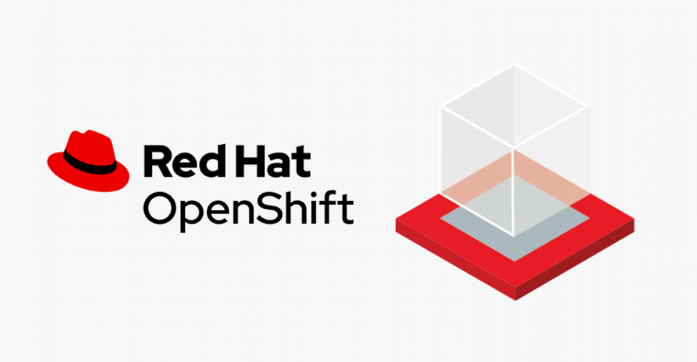

# OpenShift Workshop

## Table of Contents
<!---
- [Prerequisite for workshop (Instructor Only)](prereq.md)
- Complex Cloud-Native Application with Live Flight Track Demo](liveflight.md)

--->

- [Deploy application to openshift with s2i](deploywiths2i.md)
- [Basic Openshift Topology](openshifttopology.md)
- [Configuration Management with Environment Variable, Configmap & Secret](evconfigsecret.md)
- [Application Health check](apphealth.md)
- [Scaling up your application in order to handle workload](scale.md)

  Optional Workshop

- [OOTB Application Monitoring, Alert & User workload monitoring](monitor.md)
- [Viewing and working with logs generated by your application](logging.md)
- [Basic Container Storage](storage.md)
- [Basic Serverless, auto scale up & scale down by request](serverless.md)

