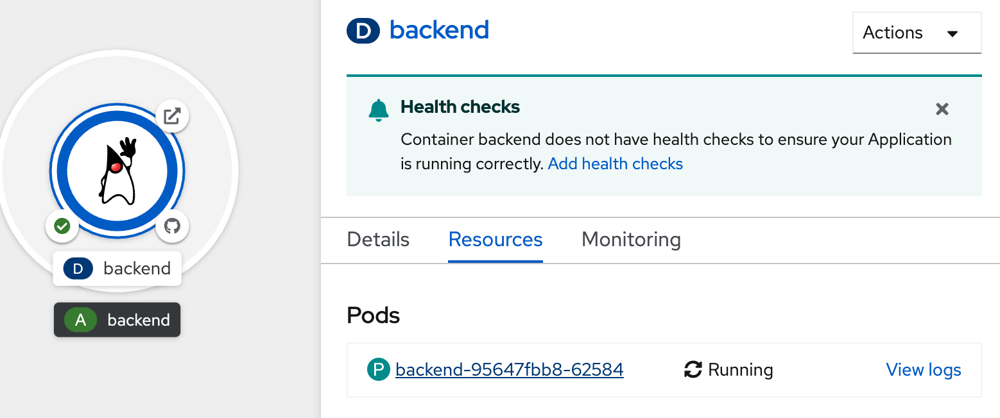
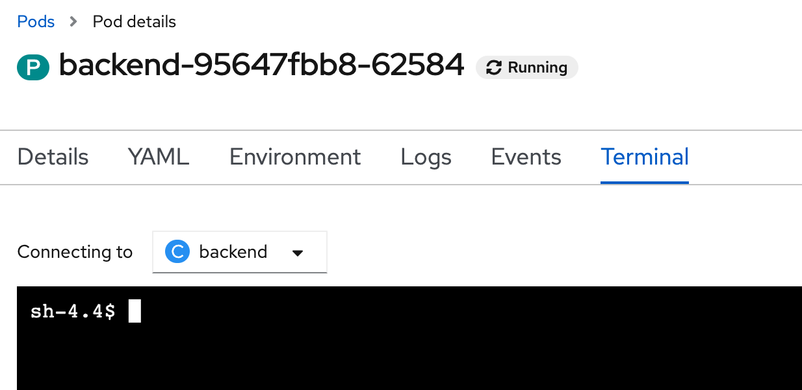
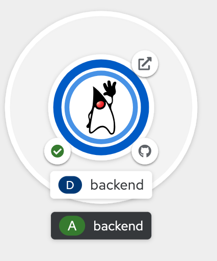
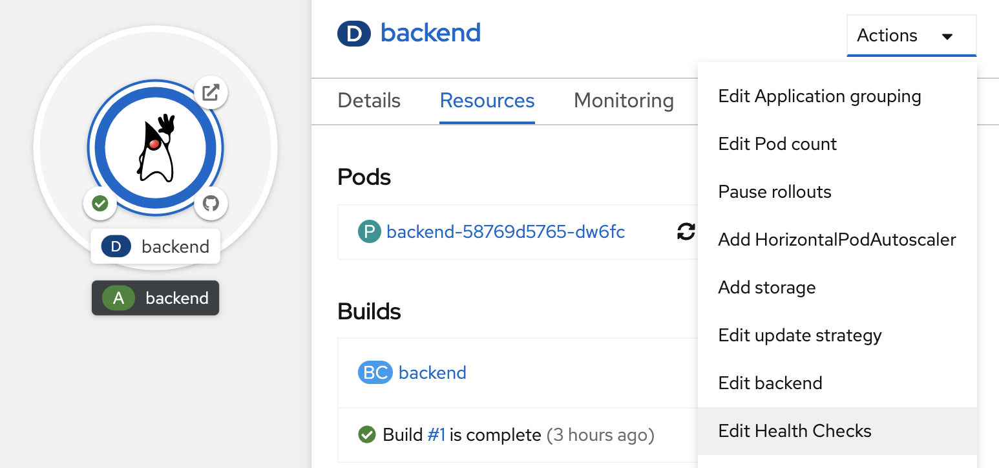
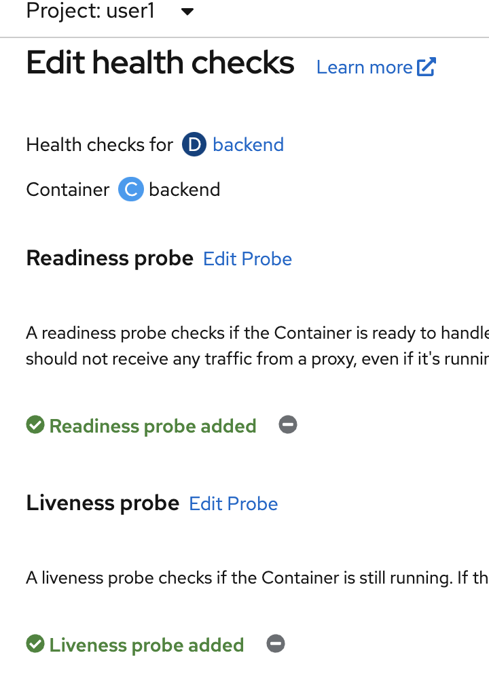
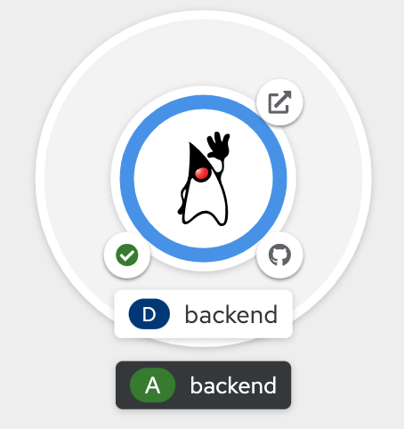
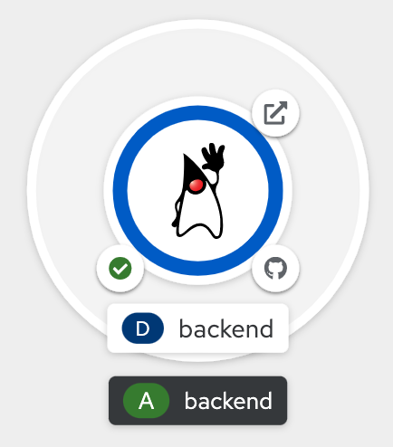
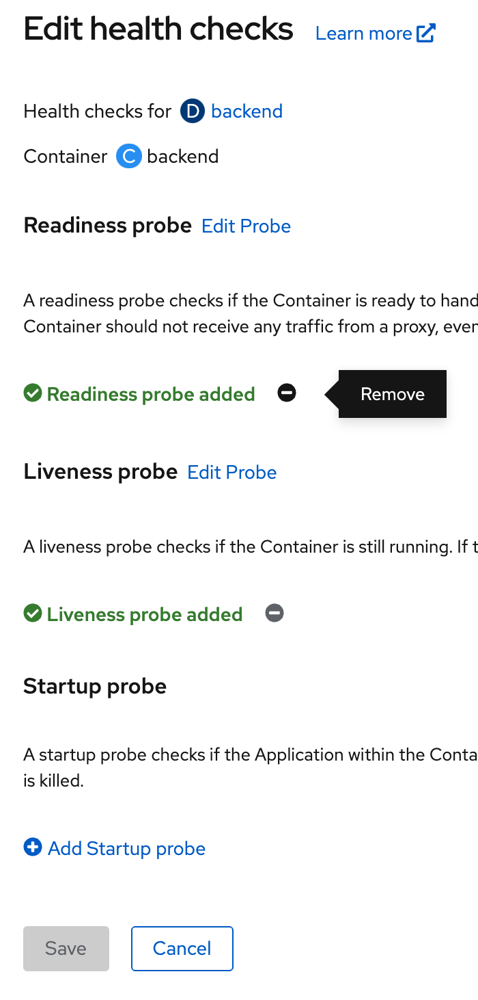

# Application Health check
<!-- TOC -->

- [Application Health check](#application-health-check)
  - [Prerequisite](#prerequisite)
  - [Application Probe](#application-probe)
  - [Set Application Health Check](#set-application-health-check)
  - [Test Liveness Probe](#test-liveness-probe)
  - [Test Readiness Probe](#test-readiness-probe)
  - [Remove Application Health](#remove-application-health)
  - [Next Step](#next-step)

<!-- /TOC -->
## Prerequisite
- Complete [Deploy java application (quarkus) to openshift with s2i](deploywiths2i.md)
- Go to your project (same as your username)
- Open Web Terminal by click '>_' on top of OpenShift Web Console
- use web terminal to run command line

## Application Probe
A probe is a Kubernetes action that periodically performs diagnostics on a running container. Currently, two types of probes exist, each serving a different purpose.

Readiness Probe
A Readiness check determines if the container in which it is scheduled is ready to service requests. If the readiness probe fails a container, the endpoints controller ensures the container has its IP address removed from the endpoints of all services. A readiness probe can be used to signal to the endpoints controller that even though a container is running, it should not receive any traffic from a proxy.

For example, a Readiness check can control which Pods are used. When a Pod is not ready, it is removed.

Liveness Probe
A Liveness checks determines if the container in which it is scheduled is still running. If the liveness probe fails due to a condition such as a deadlock, the kubelet kills the container The container then responds based on its restart policy.

- Review Application Liveness Probe 
  - review code URL: https://raw.githubusercontent.com/chatapazar/openshift-workshop/main/src/main/java/org/acme/microprofile/health/SimpleHealthCheck.java
  - go to web terminal, connect to backend pod
    ```bash
    POD=$(oc get pods --no-headers -l app=backend | grep backend |head -n 1| awk '{print $1}')
    oc rsh $POD
    ```
    after connect to pod, shell will change from 'bash-4.4' to 'sh-4.4'
    ```bash
    POD=$(oc get pods --no-headers -l app=backend | grep backend |head -n 1| awk '{print $1}')
    bash-4.4 ~ $ oc rsh $POD
    sh-4.4$ 
    ```
  - test call liveness probe of application
    ```bash
    curl -v http://localhost:8080/q/health/live
    ```
    example output
    ```bash
    < HTTP/1.1 200 OK
    < content-type: application/json; charset=UTF-8
    < content-length: 141
    < 

    {
        "status": "UP",
        "checks": [
            {
                "name": "Sample Live health check",
                "status": "UP"
            }
        ]
    * Connection #0 to host localhost left intact
    }
    ```
  - test stop liveness (simulate pod not working) and test call liveness probe of application
    ```bash
    curl http://localhost:8080/backend/stop
    curl -v http://localhost:8080/q/health/live
    ```
    example output
    ```bash
    < HTTP/1.1 503 Service Unavailable
    < content-type: application/json; charset=UTF-8
    < content-length: 145
    < 

    {
    "status": "DOWN",
    "checks": [
        {
            "name": "Sample Live health check",
            "status": "DOWN"
        }
    ]
    * Connection #0 to host localhost left intact
    }
    ```
  - start liveness again and test call liveness probe of application
    ```bash
    curl http://localhost:8080/backend/start
    curl -v http://localhost:8080/q/health/live
    ```
    example output
    ```bash
    < HTTP/1.1 200 OK
    < content-type: application/json; charset=UTF-8
    < content-length: 141
    < 

    {
        "status": "UP",
        "checks": [
            {
                "name": "Sample Live health check",
                "status": "UP"
            }
        ]
    * Connection #0 to host localhost left intact
    }
    ```
  - exit from pod
    ```bash
    exit
    ```  
- Review Application Readiness Probe 
  - review code URL: https://raw.githubusercontent.com/chatapazar/openshift-workshop/main/src/main/java/org/acme/microprofile/health/DatabaseConnectionHealthCheck.java
  - click topology in left menu, click Duke icon (backend deployment), click pod name link (such as 'P backend-xxxx-xxxxx' link)
     
  - in Pod details, click Terminal Tab, web console will show terminal to backend pod.
    
  - test call readyness probe of application
    ```bash
    curl -v http://localhost:8080/q/health/ready 
    ```
    example output
    ```bash
    < HTTP/1.1 200 OK
    < content-type: application/json; charset=UTF-8
    < content-length: 149
    < 

    {
        "status": "UP",
        "checks": [
            {
                "name": "Database connection health check",
                "status": "UP"
            }
        ]
    * Connection #0 to host localhost left intact
    }
    ```
  - test down readyness prove of application and re-test again
    ```bash
    curl http://localhost:8080/databasestatus/down
    curl -v http://localhost:8080/q/health/ready 
    ```
    example output
    ```bash
    < HTTP/1.1 503 Service Unavailable
    < content-type: application/json; charset=UTF-8
    < content-length: 153
    < 

    {
        "status": "DOWN",
        "checks": [
            {
                "name": "Database connection health check",
                "status": "DOWN"
            }
        ]
    * Connection #0 to host localhost left intact
    }
    ```  
  - up readyness probe of application, and re-test again
    ```bash
    curl http://localhost:8080/databasestatus/up
    curl -v http://localhost:8080/q/health/ready 
    ```
    example output
    ```bash
    < HTTP/1.1 200 OK
    < content-type: application/json; charset=UTF-8
    < content-length: 149
    < 

    {
        "status": "UP",
        "checks": [
            {
                "name": "Database connection health check",
                "status": "UP"
            }
        ]
    * Connection #0 to host localhost left intact
    }
    ```
- back to Topology Page
  
## Set Application Health Check
- go to web terminal
- pause auto re-deploy from deployment update configuration trigger
  ```bash
  oc rollout pause deployment/backend
  ```
- set readiness probe and liveness probe, resume deployment update configuration trigger
  ```bash
  oc set probe deployment/backend --readiness --get-url=http://:8080/q/health/ready --initial-delay-seconds=20 --failure-threshold=1 --period-seconds=3 --timeout-seconds=5
  oc set probe deployment/backend --liveness --get-url=http://:8080/q/health/live --initial-delay-seconds=20 --failure-threshold=1 --period-seconds=10 --timeout-seconds=5
  oc rollout resume deployment/backend
  ```
- wait until backend re-deploy complete
   
- view current health check, click topology in left menu, click Duke icon (backend deployment), at actions menu, select edit Health Checks, view current Health checks
   
     

## Test Liveness Probe
- go to web terminal
- check current pod
  ```bash
  oc get pods -l app=backend
  ```
  example result, check restarts is 0
  ```bash
  NAME                       READY   STATUS    RESTARTS   AGE
  backend-58769d5765-dw6fc   1/1     Running   0          15h
  ```
- call stop api for simulate pod stop, go to web terminal
  ```bash
  POD=$(oc get pods --no-headers -l app=backend | grep backend |head -n 1| awk '{print $1}')
  oc exec $POD -- curl -s http://localhost:8080/backend/stop
  ```
- check liveness probe error 
  ```bash
  oc describe pod $POD
  ```
  example result, see Liveness probe failed, after that openshift will auto-restart pod
  ```bash
  ...
  Warning  Unhealthy       7s (x2 over 7m27s)  kubelet  Liveness probe failed: HTTP probe failed with statuscode: 503
  Normal   Killing         7s (x2 over 7m27s)  kubelet  Container backend failed liveness probe, will be restarted
  Normal   Pulling         7s (x4 over 19m)    kubelet  Pulling image "image-registry.openshift-image-registry.svc:5000/user1/backend@sha256:c444188385159d4b1c7fe493334518a53d26c179534572f48c96a719d747064a"
  Normal   Started         6s (x3 over 19m)    kubelet  Started container backend
  Normal   Created         6s (x3 over 19m)    kubelet  Created container backend
  ```   
- check result, openshift will auto-restart pod after liveness probe error
  ```bash
  oc get pods -l app=backend
  ```
  example result, check restarts is 1
  ```bash
  NAME                                         READY   STATUS      RESTARTS   AGE
  backend-58769d5765-dw6fc                     1/1     Running     1          15h
  ```

## Test Readiness Probe
- go to web terminal
- check current pod  
  ```bash
  oc get pods -l app=backend
  ```
  example result, check ready is 1/1
  ```bash
  NAME                                         READY   STATUS      RESTARTS   AGE
  backend-58769d5765-dw6fc                     1/1     Running     1          15h
  ```
- test call backend api from route
  ```bash
  BACKEND_URL=http://$(oc get route backend -o jsonpath='{.spec.host}')
  curl $BACKEND_URL/backend
  ```
  example response
  ```bash
  Backend version:v1, Response:200, Host:backend-58769d5765-dw6fc, Status:200, Message: Hello, World
  ```
- set readiness prove of backend to down
  ```bash
  POD=$(oc get pods --no-headers -l app=backend | grep backend |head -n 1| awk '{print $1}')
  oc exec $POD -- curl -s http://localhost:8080/databasestatus/down
  ```
- check readiness probe error
  ```bash
  oc describe pod $POD
  ```
  example result, see Readiness probe failed
  ```bash
  Normal   Killing         18m (x2 over 25m)  kubelet  Container backend failed liveness probe, will be restarted
  Normal   Created         18m (x3 over 37m)  kubelet  Created container backend
  Normal   Started         18m (x3 over 37m)  kubelet  Started container backend
  Warning  Unhealthy       3s (x7 over 21s)   kubelet  Readiness probe failed: HTTP probe failed with statuscode: 503
  ```bash
- check pod not ready
  ```bash
  oc get pods -l app=backend
  ```
  example result, check ready change to 0/1
  ```bash
  NAME                       READY   STATUS    RESTARTS   AGE
  backend-58769d5765-dw6fc   0/1     Running   2          15h
  ```
  see topology, There will be a circle around the icon (duke icon) in light blue.
   
- test call backend again
  ```bash
  BACKEND_URL=http://$(oc get route backend -o jsonpath='{.spec.host}')
  curl $BACKEND_URL/backend
  ```
  example result, show can not call backend 
  ```bash
          <li>
              <strong>Route and path matches, but all pods are down.</strong>
              Make sure that the resources exposed by this route (pods, services, deployment configs, etc) have at least one pod running.
            </li>
          </ul>
        </div>
      </div>
    </body>
  </html>
  ```
- set readiness probe up again
  ```bash
  POD=$(oc get pods --no-headers -l app=backend | grep backend |head -n 1| awk '{print $1}')
  oc exec $POD -- curl -s http://localhost:8080/databasestatus/up
  ```
- check ready
  ```bash 
  oc get pods -l app=backend
  ```
  example result, ready change back to 1/1
  ```bash
  NAME                       READY   STATUS    RESTARTS   AGE
  backend-58769d5765-dw6fc   1/1     Running   2          15h
  ```
  see topology, There will be a circle around the icon (duke icon) in dark blue.
  
- re-test call backend again
  ```bash
  BACKEND_URL=http://$(oc get route backend -o jsonpath='{.spec.host}')
  curl $BACKEND_URL/backend
  ```
  example output
  ```
  Backend version:v1, Response:200, Host:backend-58769d5765-dw6fc, Status:200, Message: Hello, World
  ```
## Remove Application Health
- view current health check, click topology in left menu, click Duke icon (backend deployment), at actions menu, select edit Health Checks, view current Health checks
   
- remove readiness and liveness health check (click minus icon), click save and wait until backend redeploy complete (change circle aroubd duke icon to dark blue)
    

## Next Step
- [Scale Application with OpenShift](scale.md)

