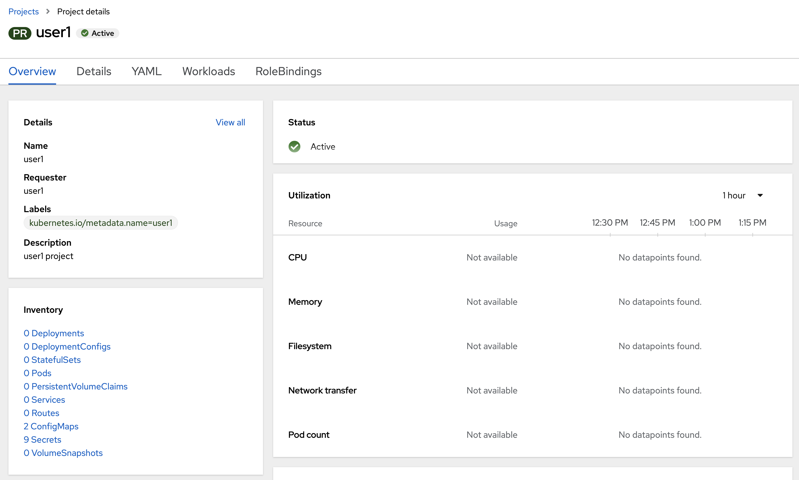
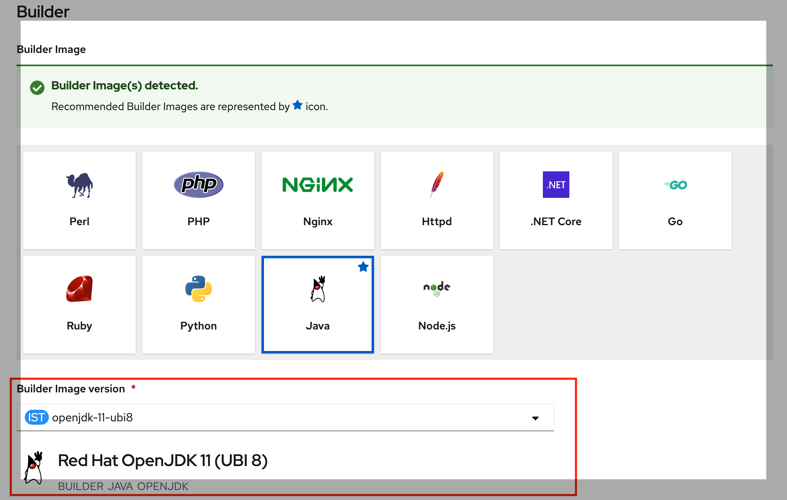
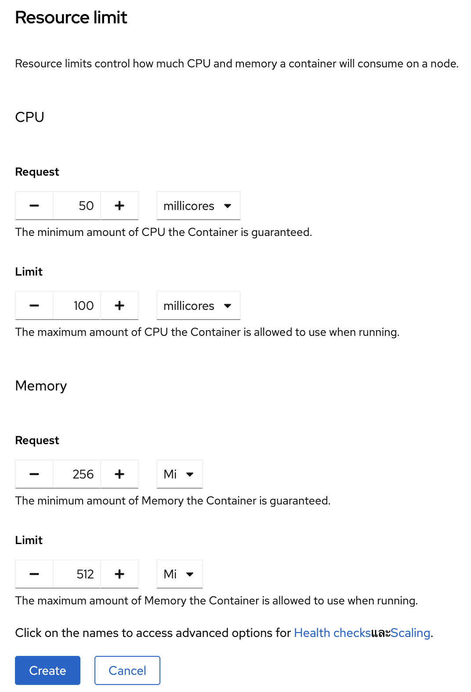

# Deploy java application (quarkus) to openshift with s2i
<!-- TOC -->

- [Deploy java application (quarkus) to openshift with s2i](#deploy-java-application-quarkus-to-openshift-with-s2i)
  - [Create Openshift Project](#create-openshift-project)
  - [Deploy java Application to Openshift with OpenShift Developer Console (S2I)](#deploy-java-application-to-openshift-with-openshift-developer-console-s2i)

<!-- /TOC -->

## Create Openshift Project
- open browser to https://console-openshift-console.apps.xxx.opentlc.com
  - confirm URL from instructor
- login to openshift with your username/password
  - username: 'userx'
  - password: openshift
  
- select Developer Perspective from left menu (if openshift don't default page for you)
  
- create project with your username such as 'user1'
  - go to dropdown at Project: All Projects
  - click Create Project
  
  - set Name*= 'userx', Display Name = 'userx', Description = 'userx workshop'
  
  - click create, openshift console will change page to new project
  

## Deploy java Application to Openshift with OpenShift Developer Console (S2I)
- click +Add menu in left pane
- select From Git
  
- in Import from Git page, input Git Repo URL with 'https://github.com/chatapazar/openshift-workshop.git'
- wait until Openshift validate URL complete (page will show validated complete icon)
  
  - Optional: Not required for this lab! 
    
    you can input additional information for get source code such as
    - Git Reference: for branch, tag, or commit. (default s2i will checkout from default branch such as main or master)
    - Context dir: in case source code don't place in root of git such as /code
    - Source Secret: provide user/password for private repository
    
- OpenShift S2I will automatic select Builder Image from your source code, in case s2i can't detect base image. you can manual select.
- developer can select builder image versio from dropdown list such as java application can select base image for jdk8 or jdk11 
- for this workshop, Please select 'openjdk-11-ubi8'  or Red Hat OpenJDK 11 (UBI 8)
  
- next, in general section set
  - Application name: backend
  - Name: backend
  - Resources: select Deployment (deployment for standard Kubernetes, DeploymentConfig is deployment with extension feature from OpenShift)
  - Advanced Options: checked Create a Route to the Application
  
- before click create, in advanced option
  - click 'Labels' link
  
  - add label 'app=backend'
  
  - click 'Resource limits' link
  - set CPU
  
- a
