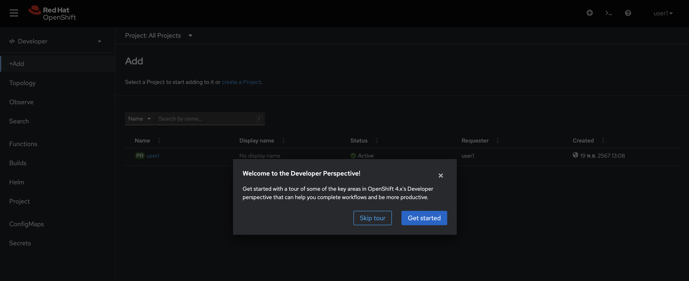
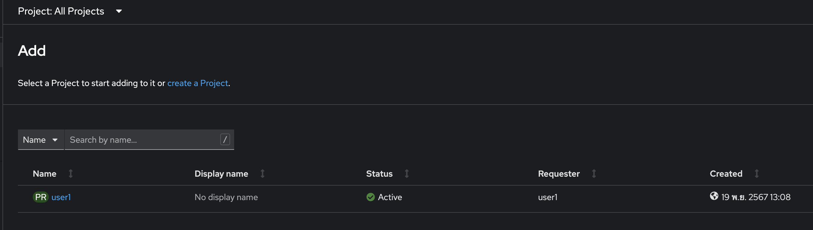
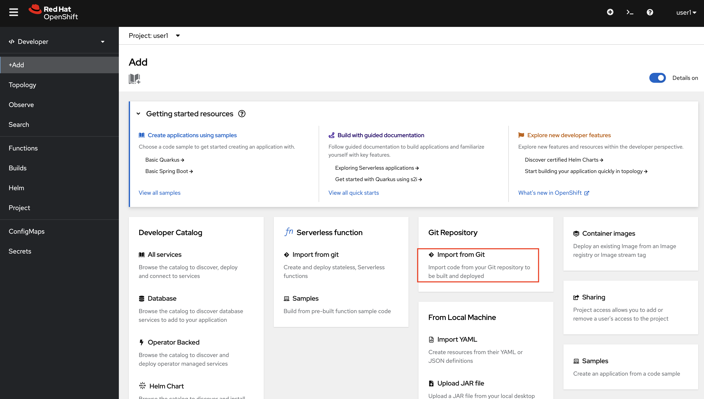
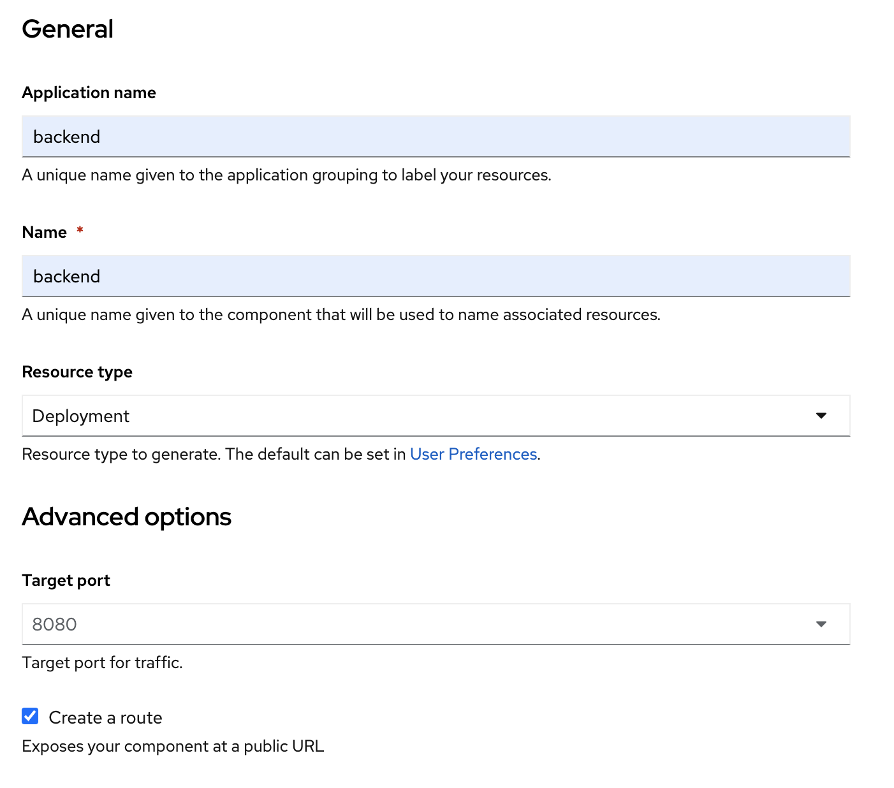
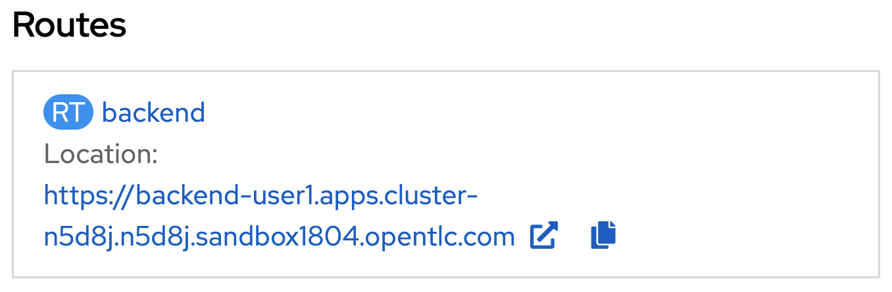
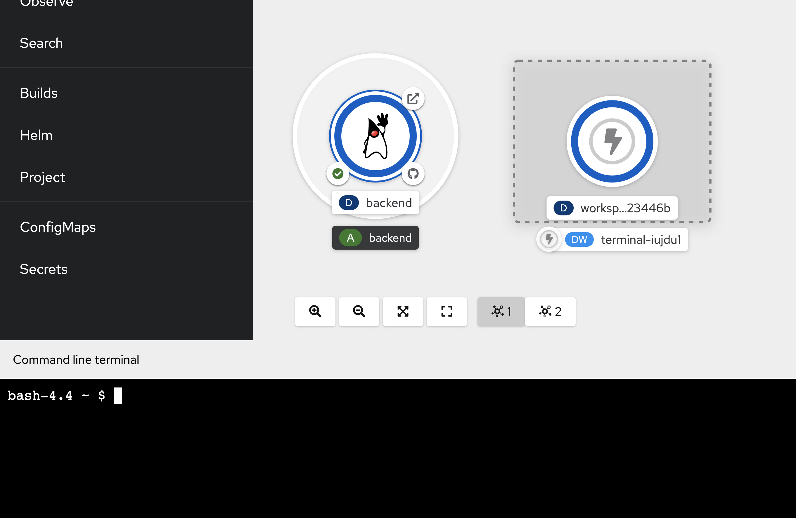

# Deploy application (quarkus) to openshift with s2i
<!-- TOC -->

- [Deploy application (quarkus) to openshift with s2i](#deploy-application-quarkus-to-openshift-with-s2i)
  - [Openshift Project](#openshift-project)
  - [Set Default OpenShift Console!!!](#set-default-openshift-console)
  - [Deploy Application to Openshift with OpenShift Developer Console (S2I)](#deploy-application-to-openshift-with-openshift-developer-console-s2i)
  - [Test Rest API of Backend Application](#test-rest-api-of-backend-application)
  - [Next Step](#next-step)

<!-- /TOC -->
<!-- /TOC -->
  - [Next Step](#next-step)

<!-- /TOC -->

## Openshift Project
- open browser to URL from Register Page

  - confirm URL from instructor

- login to openshift with your username/password
  
  - username: `xxx` --> get from register page
  - password: `xxx` --> get from register page
  

- if login first time, dev console will launch developer quick tour, click Skip tour
  
  

- select Developer Perspective from left menu (if openshift don't default page for you)

  

- default project is your name. such as `user1`, `user2`  
- if deveveloper console not default your project, click Project name 'PR userx' in topology or select from Project Dropdownlist
  
  
  
- Optional: How to Create Project (Don't create project in this workshop, we prepare project for you now!)
  - create project with your username such as `user1`  
    - go to dropdown at Project: All Projects
    - click Create Project 
    
    - set Name*= `userx`, Display Name = `userx`, Description = `userx workshop` (Please use your username to Project name!!!)
    
    - click create, openshift console will change page to new project
    


## Set Default OpenShift Console!!!
- click user at top-right of OpenShift Console, select User References

  

- In General Section, you can change theme from dark mode (default) to light mode

  

- In Application Section, set default resource type from `Serverless` to `Deployment`

  


## Deploy Application to Openshift with OpenShift Developer Console (S2I)
- click +Add menu in left pane
- select Git Repository, Import from Git (In Git Repository, Not Serveless function)
  
  

- in Import from Git page, input Git Repo URL with `https://gitlab.com/chatapazar/openshift-workshop.git`

- wait until Openshift validate URL complete (page will show validated complete icon)

  

  - Optional: Not required for this lab! (by click Show advanced Git options)
    
    you can input additional information for get source code such as
    - Git Reference: for branch, tag, or commit. (default s2i will checkout from default branch such as main or master)
    - Context dir: in case source code don't place in root of git such as /code
    - Source Secret: provide user/password for private repository

    

- Click Edit Import Strategy for change default Builder Image (pencil icon)

  

- OpenShift S2I will automatic select Builder Image from your source code, in case s2i can't detect base image. you can manual select.
- developer can select builder image version from dropdown list such as java application can select base image for jdk8 or jdk11 
  
- for this workshop, Please select 'openjdk-17-ubi8'  or Red Hat OpenJDK 17 (UBI 8) (default is openjdk-17-ubi8, it's new jdk version. Don't change it! :D )

- next, in general section set value of

  - Application name: `backend`
  - Name: `backend`
  - Resources: select `Deployment` (default is serverless, deployment for standard Kubernetes, DeploymentConfig is deployment with extension feature from OpenShift, user can set default in user reference menu!!!)
  - Build Option: `Builds` (to use openshift s2i)
  - Advanced Options: checked Create a Route to the Application

  

  - leave other default value
  
- before click create, in advanced option
  - click `Labels` link
  
  - add label `app=backend`
  
  - click `Resource limits` link
  - set CPU Request: 50 millicores
  - set CPU Limit:   100 millicores
  - set Memory Request: 256 Mi
  - set Memory Limit:   512 Mi
  
  
  
  - Click Create, Console will back to Topology Page
  
  

- Click at Duke icon, Dev Console will show Deployment information

  

- in build section, OpenShift Build is creating image with S2I  
  
- click View logs at Build #1
  
- wait until build complete, see build backend-1 change from running to complete (3-5 minutes)
  
- after build complete, openshift will take the image from the build to deploy and create a pod as shown in the picture.
- click 'Topology' menu from left side for back to Topology view again
    
- wait until Pod 'backend-xxxx-xxx' change status to Running
   
- click View logs, check application start complete (wait until logging show message 'Installed features: ....') 
    
- click Topology in left pane, at duke icon, you will see Open URL link, click it to open browser to this application in new tab
    
- Or Click Location from Routes 'backend' in 'backend' Deployment information
    
- Example of backend application landing page
    
- Deployment Done!

## Test Rest API of Backend Application
- click '>_' icon in top of Openshift Web Console to open Web Terminal
    
- First Time, Web Terminal will ask you for project to initialze terminal, please select your project such as user1, click start
    
- wait until terminal start complete, command prompt will show in command line terminal
    
- Next time, you can press from the icon '>_' immediately without creating a new one.
- in command line terminal, check current project by below command
    ```bash
    oc project
    ```
    example of output
    ```bash
    Using project "user1" from context named "user1-context" on server "https://172.30.0.1:443".
    ```
- if current project is not your project (such as result is not 'Using project "user1"'), use below command to set current project to command line context
    ```bash
    oc project <your project>
    ```
- test call backend service api (REST)
  ```bash
  curl https://$(oc get route backend -o jsonpath='{.spec.host}')/backend
  ```
  example of result
  ```bash
  Backend version:v1, Response:200, Host:backend-7b5c56fc8c-t57wl, Status:200, Message: Hello, World
  ```
  - remark: Host name in result of this api is name of Pod, please check and verify it!
- if done!, You are ready for the next step.
## Next Step
- [Basic Openshift Topology](openshifttopology.md)