# Configuration Management with Environment Variable, Configmap & Secret
<!-- TOC -->

- [Configuration Management with Environment Variable, Configmap \& Secret](#configuration-management-with-environment-variable-configmap--secret)
  - [Prerequisite](#prerequisite)
  - [Environment Variable](#environment-variable)
  - [Configmap](#configmap)
  - [Secret](#secret)
  - [Next Step](#next-step)

<!-- /TOC -->
## Prerequisite
- Complete [Deploy application to openshift with s2i](deploywiths2i.md)
- Go to your project (same as your username)
- Open Web Terminal by click '>_' on top of OpenShift Web Console
- use web terminal to run command line

## Environment Variable
You can set environment variables for containers running in a pod. Additionally, Kubernetes automatically exposes certain runtime information via environment variables.
- Review Code, Check Environment Variable

  - https://raw.githubusercontent.com/chatapazar/openshift-workshop/main/src/main/resources/application.properties
  
  - In this properties, app.backend is url of backend service, we use this property for Rest Client 
    ```yaml
    app.backend=https://httpbin.org/status/200
    ```
  - test call backend service in web terminal console 
    ```bash
    curl -v https://httpbin.org/status/200
    curl -v https://httpbin.org/status/400
    ```
- Check Current Environment, Test with below command
    ```bash
    BACKEND_URL=https://$(oc get route backend -o jsonpath='{.spec.host}')
    curl $BACKEND_URL/backend
    ```
    sample output, see Response:200
    ```bash
    Backend version:v1, Response:200, Host:backend-56957dcc4f-t9bpf, Status:200, Message: Hello, World
    ```
- Change Environment Variable, From Topology, click Duke icon (backend deployment), backend link in side panel (click link at 'D backend')

    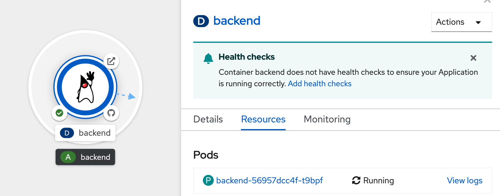

- select Environment tab, 

    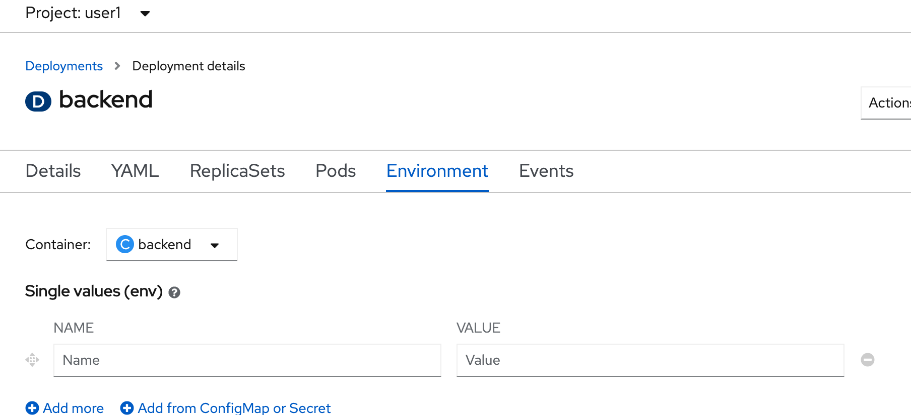

- in single values(env), input name: `app.backend` and value: `https://httpbin.org/status/400`, clicke save

    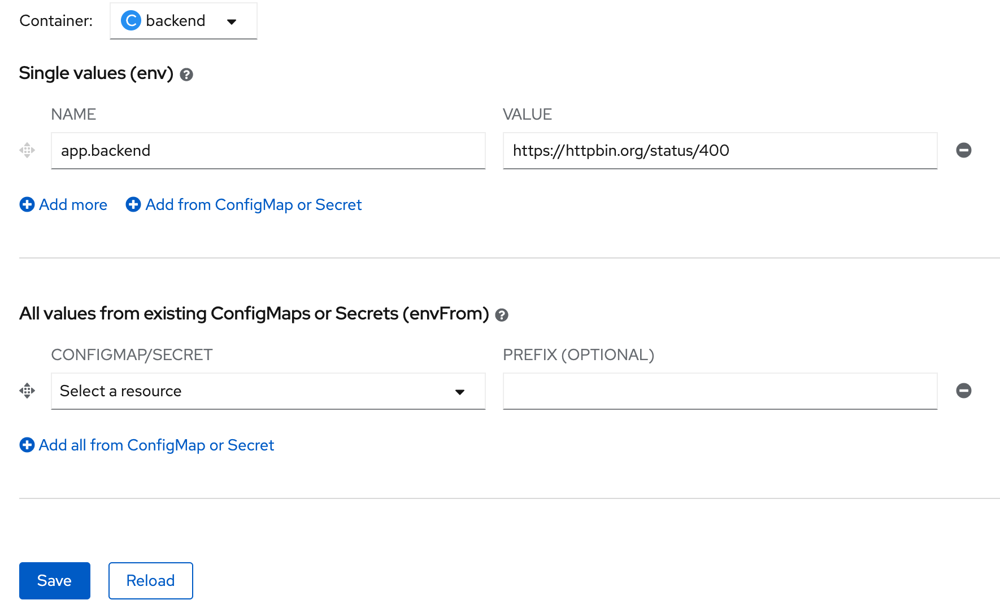

- wait until openshift redeploy backend success

    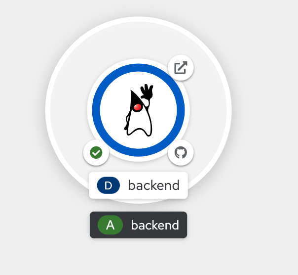

- back to web terminal, test call backend again

  ```bash
  BACKEND_URL=https://$(oc get route backend -o jsonpath='{.spec.host}')
  curl $BACKEND_URL/backend
  ```

  check output change, Response:400 

  ```bash
  Backend version:v1, Response:400, Host:backend-6cf95f994d-cgxsb, Status:400, Message: Hello, World
  ```

- **Wait a few minutes if curl result is show `Application is not available`, and try again.**

  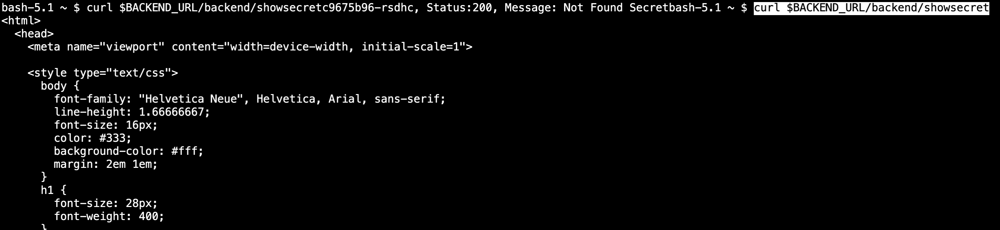

## Configmap
Many applications require configuration using some combination of configuration files, command line arguments, and environment variables. These configuration artifacts should be decoupled from image content in order to keep containerized applications portable.

The ConfigMap object provides mechanisms to inject containers with configuration data while keeping containers agnostic of OpenShift Container Platform. A ConfigMap can be used to store fine-grained information like individual properties or coarse-grained information like entire configuration files or JSON blobs.

- create example ConfigMap, click ConfigMaps at left menu, click Create ConfigMap

  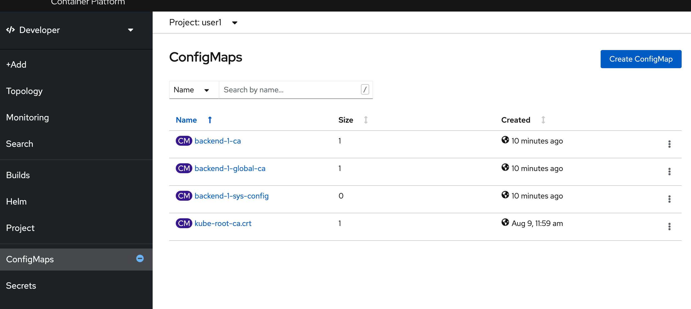  

- Click YAML View
- Create ConfigMap with YAML, copy below yaml to editor, click create
  - Remark: change namespace to your username

  ```yaml
  apiVersion: v1
  kind: ConfigMap
  metadata:
    name: example
    namespace: <user user name>
  data:
    app.backend.200: https://httpbin.org/status/200
    app.backend.400: https://httpbin.org/status/400  
  ```

  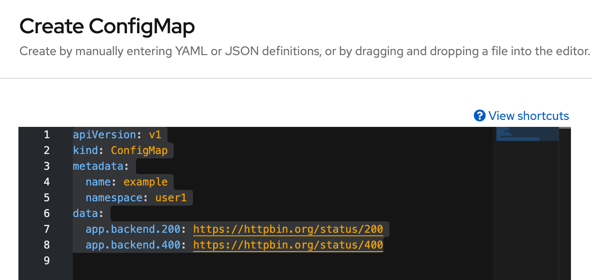 

- Review configmap `example` value in data section

  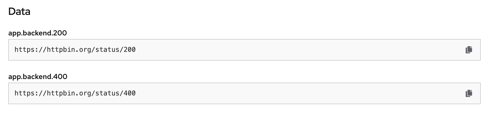 

- back to Topology, click Duke icon (backend deployment), backend link in side panel (click link at 'D backend'), click Environment Tab

- remove old `app.backend` environment variable

  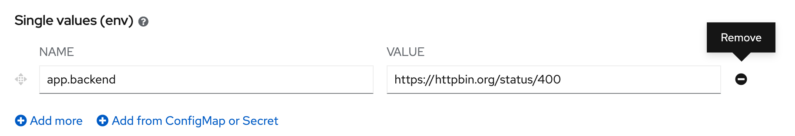 

- click 'Add from ConfigMap or Secret', set name: `app.backend`, value: 'CM example' and key: `app.backend.200`

  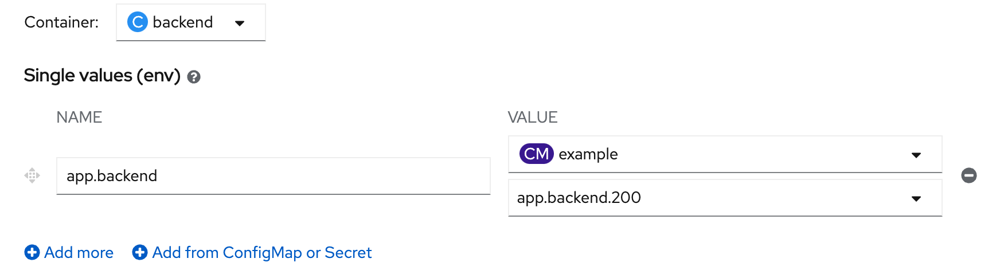 

- click save, and wait until backend redeploy complete

  

- back to web terminal, test call backend again

  ```bash
  BACKEND_URL=https://$(oc get route backend -o jsonpath='{.spec.host}')
  curl $BACKEND_URL/backend
  ```

  check output change, Response:200 

  ```bash
  Backend version:v1, Response:200, Host:backend-95647fbb8-2xql7, Status:200, Message: Hello, World
  ```

## Secret
The Secret object type provides a mechanism to hold sensitive information such as passwords, OpenShift Container Platform client configuration files, dockercfg files, private source repository credentials, and so on. Secrets decouple sensitive content from the pods. You can mount secrets into containers using a volume plug-in or the system can use secrets to perform actions on behalf of a pod.

- at web terminal, test curret value of secret message : `Not Found Secret`

  ```bash
  curl $BACKEND_URL/backend/showsecret
  ```

  example result

  ```bash
  Backend version:v1, Response:200, Host:backend-95647fbb8-62584, Status:200, Message: Not Found Secret
  ```

- click Secrets from left menu
  
  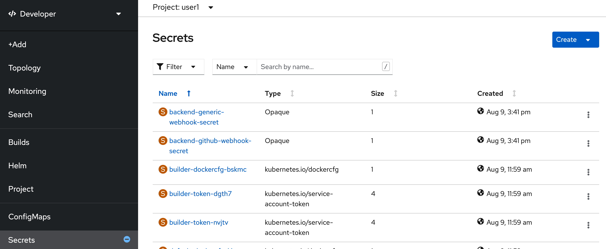

- select create with key/value secret

  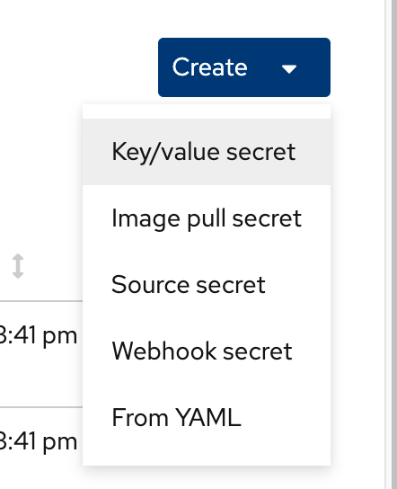

- in create key/value secret page, set secret name: example, key: `app.secretMessage`, value: `Hi! World of Quarkus!`, click Create

  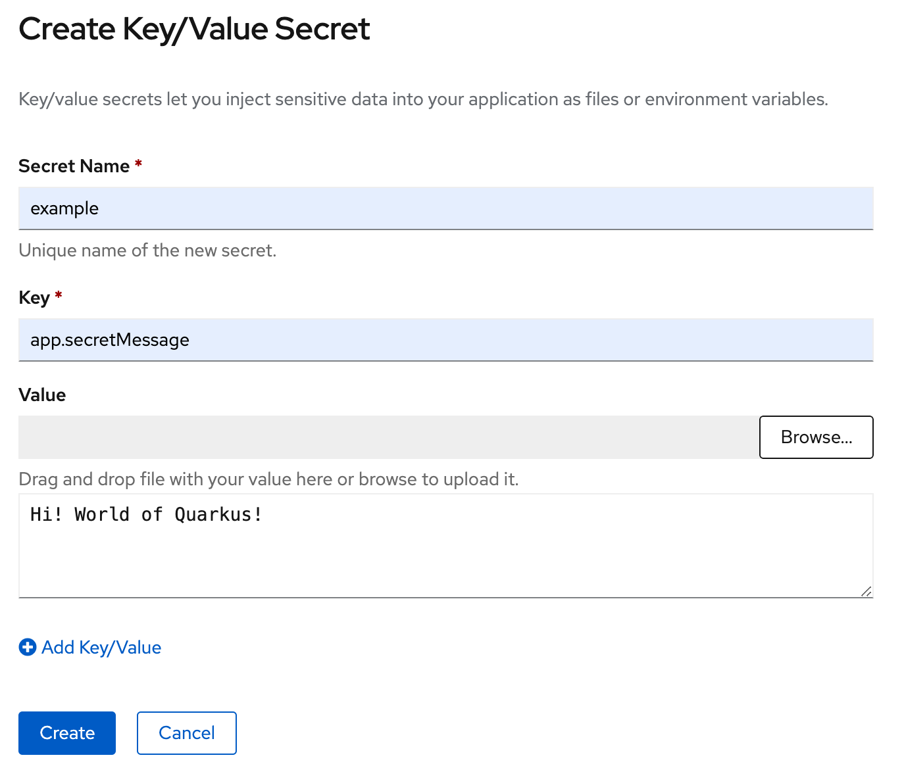

- check in secret `example`, in data section, show `app.secretMessage` and value with encryption (you can click copy and paste in your editor to view message)

  

- back to Topology, click Duke icon (backend deployment), backend link in side panel (click link at 'D backend'), click Environment Tab

- click `Add from ConfigMap or Secret`, set name: `app.secretMessage`, value: `S example` and key: `app.secretMessage`

  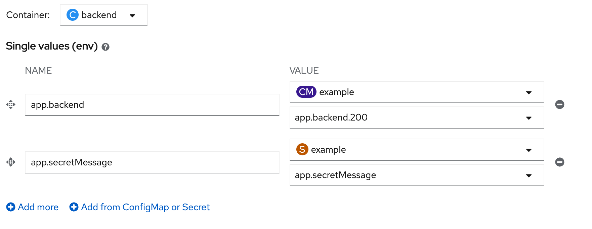

- click save, wait until backend redeploy complete
- Re-Test showsecret api again

  ```bash
  curl $BACKEND_URL/backend/showsecret
  ```

  example result

  ```bash
  Backend version:v1, Response:200, Host:backend-5bc95899d-tdmv5, Status:200, Message: Hi! World of Quarkus!
  ```

## Next Step
- [Application Health check](apphealth.md)

