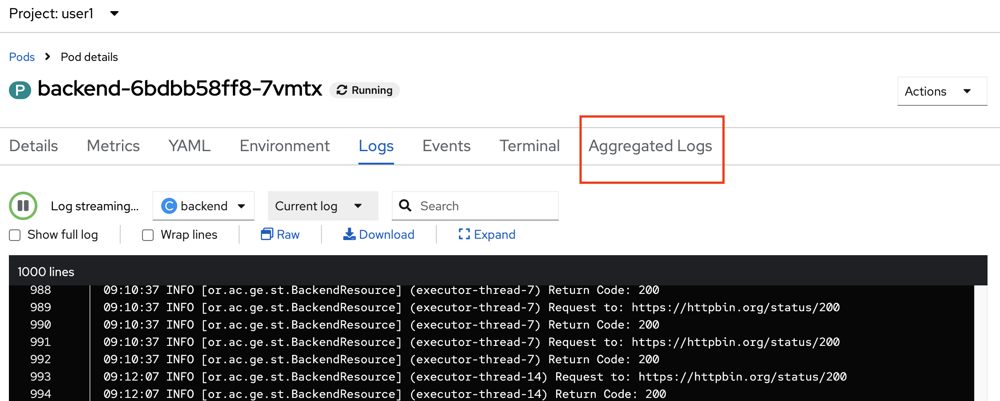
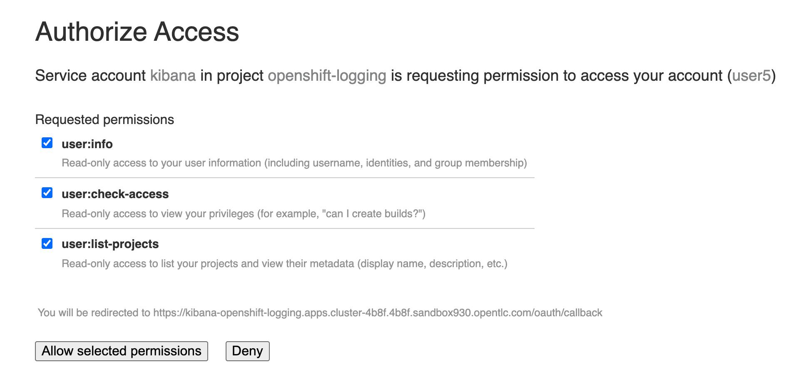
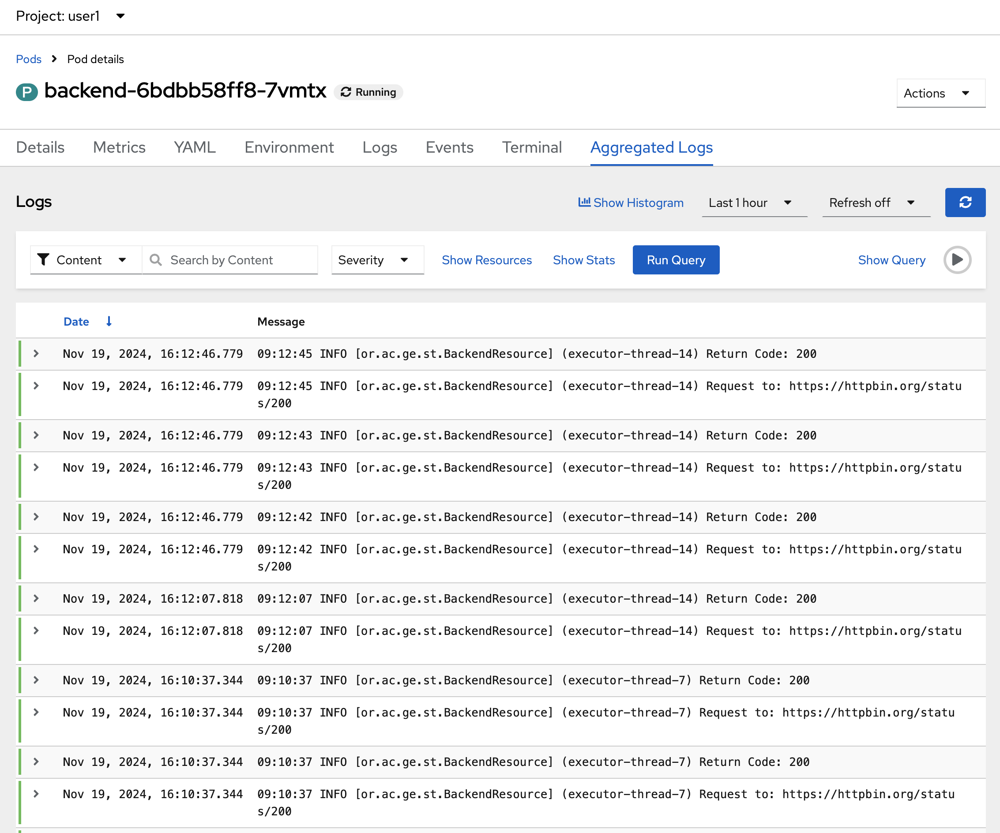
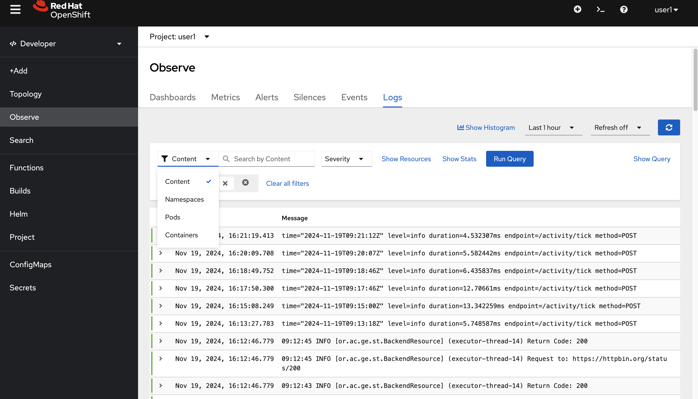
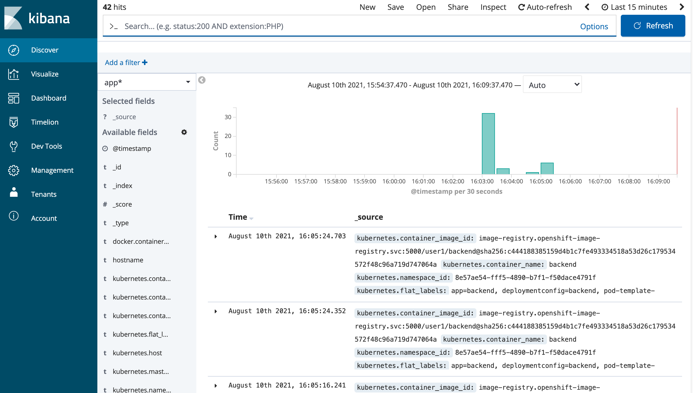

# Application Logging
<!-- TOC -->

- [Application Logging](#application-logging)
  - [Prerequisite](#prerequisite)
  - [Review Application Code Logging](#review-application-code-logging)
  - [Monitor Container Log with Developer Console](#monitor-container-log-with-developer-console)
  - [Monitor Container Log with EFK Stack in Openshift](#monitor-container-log-with-efk-stack-in-openshift)
  - [Next Step](#next-step)

<!-- /TOC -->
## Prerequisite
- Complete [Deploy application to openshift with s2i](deploywiths2i.md)
- Go to your project (same as your username)
- Open Web Terminal by click '>_' on top of OpenShift Web Console
- use web terminal to run command line

## Review Application Code Logging
- Example code with logging (Quarkus Framework)
  - Code URL: https://raw.githubusercontent.com/chatapazar/openshift-workshop/main/src/main/java/org/acme/getting/started/BackendResource.java
  - Example Code Logging
    ```java
    import org.jboss.logging.Logger;
    ...
    private static final Logger logger = Logger.getLogger(BackendResource.class);
    ...
     URL url;
            try {
                logger.info("Request to: " + backend);
    ...
    ```
- example log property (Quarkus Framework)
  - Properties URL: https://raw.githubusercontent.com/chatapazar/openshift-workshop/main/src/main/resources/application.properties
  - Example properties:
  ```prop
  #Logging
  quarkus.log.level=INFO
  # quarkus.log.category."com.example.quarkus".level=INFO
  # quarkus.log.category."com.example.quarkus.health".level=DEBUG
  quarkus.log.console.enable=true
  quarkus.log.console.format=%d{HH:mm:ss} %-5p [%c{2.}] (%t) %s%e%n
  quarkus.log.console.color=false
  %dev.quarkus.log.console.color=true
  ```

## Monitor Container Log with Developer Console
- go to web terminal
- test call backend service
  ```bash
  BACKEND_URL=http://$(oc get route backend -o jsonpath='{.spec.host}')
  curl $BACKEND_URL/backend
  ```
- view log in pod, go to Topology, click Duke icon (backend), in backend deployment select Resources Tab, click 'View logs' of Pod
  
- in pod details, select Logs tab to view log of container 'backend'
  
- re call backend service and check log in pod append (retry call 2-3 times for view logs append)
    ```bash
    BACKEND_URL=http://$(oc get route backend -o jsonpath='{.spec.host}')
    curl $BACKEND_URL/backend
    ```
    check log append at log terminal
    
- click raw icon to view log in another browser tab
  
- click download to download currnet log
  

## Monitor Container Log with EFK Stack in Openshift
- From Logs tab in Pod details, click show in Kibana icon to open kibana in new tab
  
- Optional: for firstime, openshift will request you re-login and allow authorized to kibana (with oauth), click allow selected permissions
  
- Openshift will Open Kibana from EFK Stack, default page is Discover and auto add filter with pod name, namespace/project and container name
  
- Developer can custom filter to view log.
- For monitor more than 1 pod, developer can access kibana from logging menu on top of Developer Console (near web terminal menu icon)
  
- with this link, developer can custom filter to view log.
  


## Next Step
- [Container Storage](storage.md)


