# OOTB Application Monitoring, Alert & User workload monitoring
<!-- TOC -->

- [OOTB Application Monitoring, Alert \& User workload monitoring](#ootb-application-monitoring-alert--user-workload-monitoring)
  - [Prerequisite](#prerequisite)
  - [OpenShift Default Monitoring](#openshift-default-monitoring)
  - [Review Application Performance Metric Code](#review-application-performance-metric-code)
  - [Add Application Performance Metric to OpenShift](#add-application-performance-metric-to-openshift)
  - [Add Alert to OpenShift](#add-alert-to-openshift)
  - [Next Step](#next-step)

<!-- /TOC -->
## Prerequisite
- Complete [Deploy application to openshift with s2i](deploywiths2i.md)
- Go to your project (same as your username)
- Open Web Terminal by click '>_' on top of OpenShift Web Console
- use web terminal to run command line

## OpenShift Default Monitoring
- view defalt monitoring per deployment, click topology, click duke icon (backend deployment), in backend deployment, select observe tab
  - view CPU usage,
  - view Memory usage

  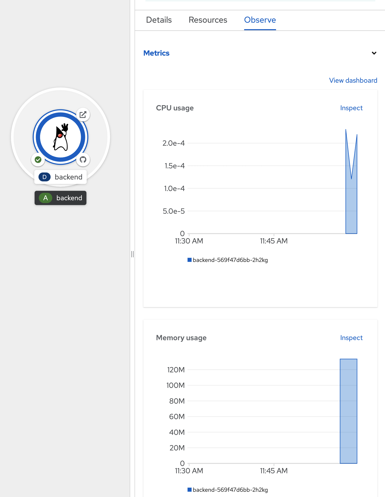

- view Project Monitoring, click Observe in left menu, select Dashboard Tab
- this page will show Monitoring Information of current project (all resources in this project)

  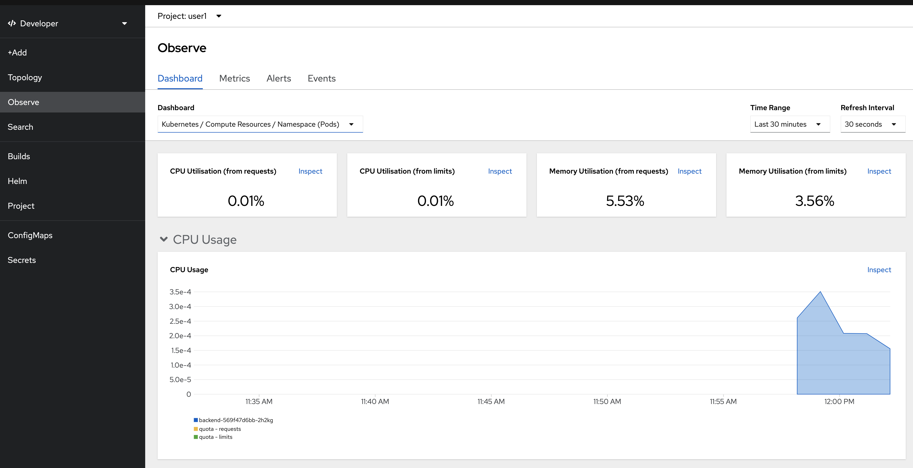

- can filter by workload, click at dashboard dropdownlist and select Kubernetes/Compute Resources/Workload, type deployment, workload backend  

  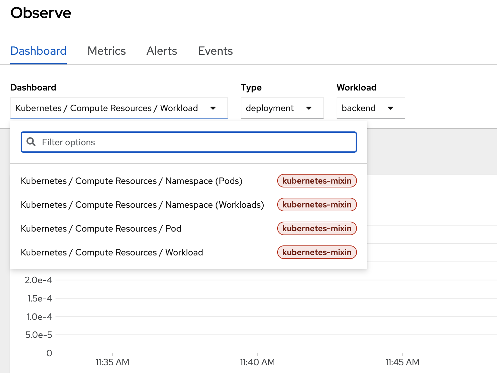

- select tab Metrics to view performance/metrics information by type, click select query dropdown list to select default metrics information such as cpu usage, memory usage, filesystem usage, etc. 

  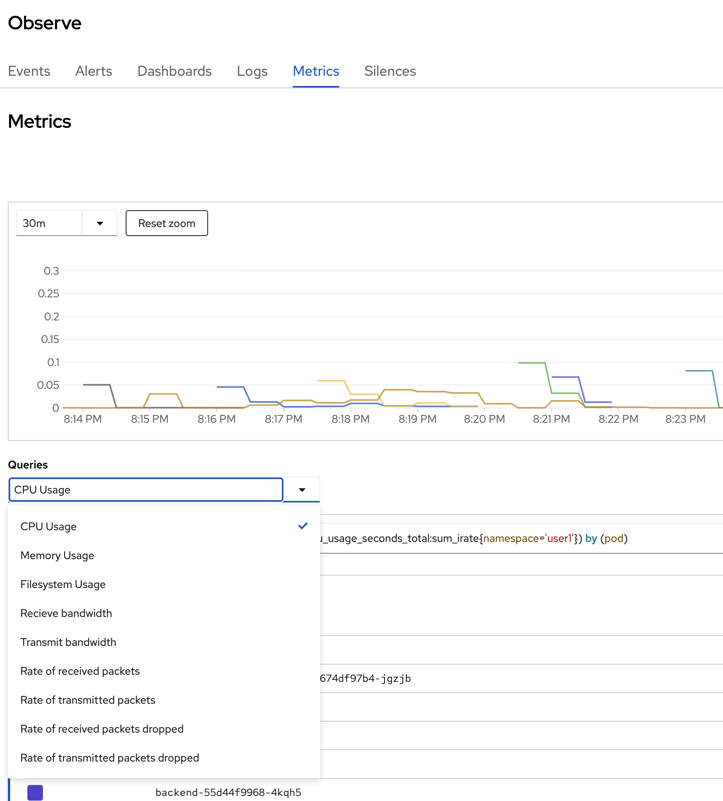

- select CPU usage, click check box 'Stacked'

    

- change to another metrics such as memory usage.

  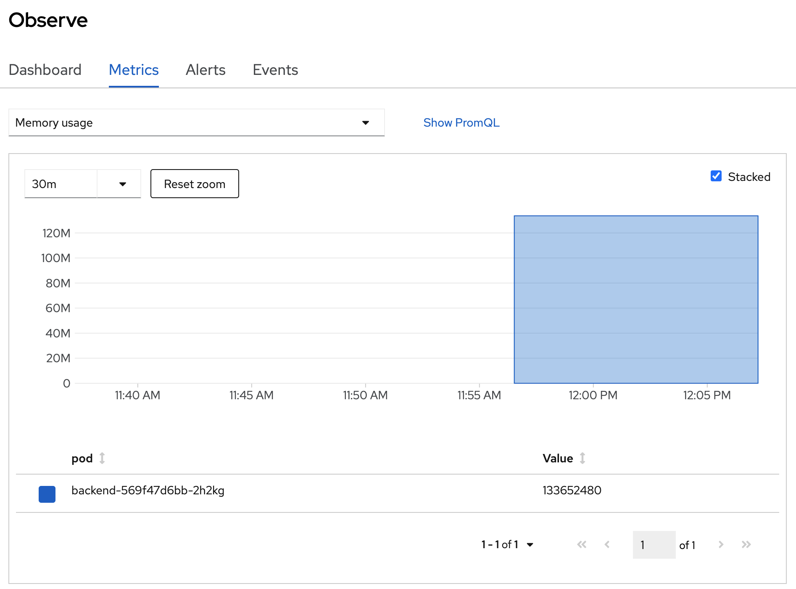 

- OpenShift Monitoring base on Prometheus Technology, you can use PromQL for retrive metric information, in select query dropdown list, select Custom query and type 'cpu' and wail auto suggestion, 

  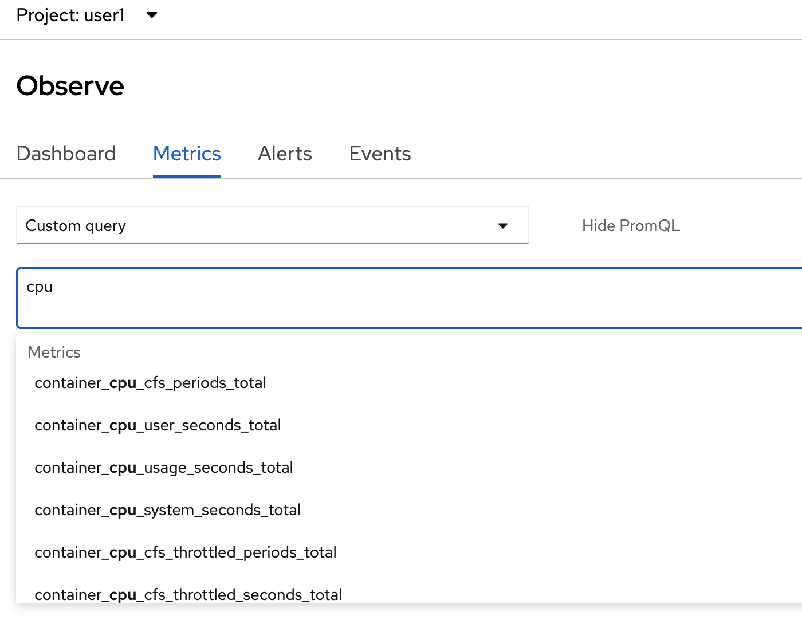 

- select 'pod:container_cpu_usage:sum' and type 'enter' button to view this metrics from PromQL

  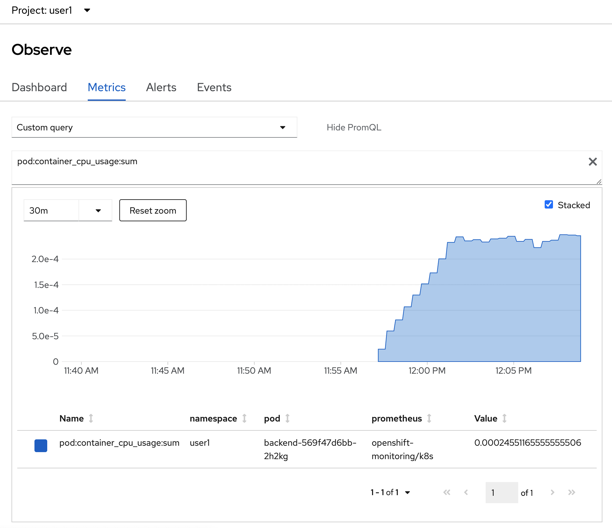 

- click Alerts tab to view all alert (the Alerting UI enables you to manage alerts, silences, and alerting rules, we will create alert in next step in this session)

  

- click Events Tab to view All event in this project or filter by resource

  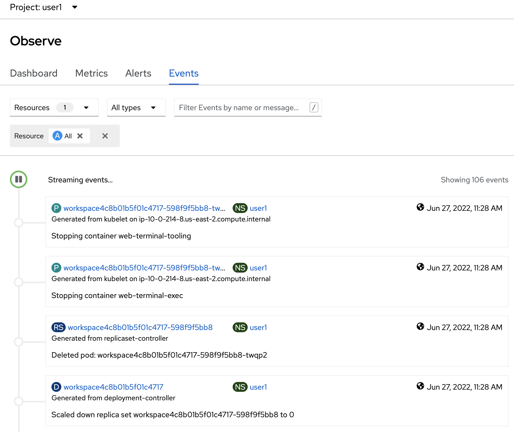 

## Review Application Performance Metric Code
Developer can enable monitoring for user-defined projects in addition to the default platform monitoring. You can now monitor your own projects in OpenShift Container Platform without the need for an additional monitoring solution. 
- review application metric code
  - backend application use quarkus microprofile metrics libraly to generate application metrics
  - example code: https://raw.githubusercontent.com/chatapazar/openshift-workshop/main/src/main/java/org/acme/getting/started/BackendResource.java
  - example custom metrics in code:

    ```java
    @Counted(
        name = "countBackend", 
        description = "Counts how many times the backend method has been invoked"
        )
    @Timed(
        name = "timeBackend", 
        description = "Times how long it takes to invoke the backend method in second", 
        unit = MetricUnits.SECONDS
        )
    @ConcurrentGauge(
        name = "concurrentBackend",
        description = "Concurrent connection"
        )
    public Response callBackend(@Context HttpHeaders headers) throws IOException {
    ```

- review example metrics of backend application, go to web terminal
- call default quarkus microprofile metrics example

  ```bash
  oc exec $(oc get pods -l app=backend | grep backend | head -n 1 | awk '{print $1}') \
  -- curl -s  http://localhost:8080/q/metrics
  ```

  example result

  ```bash
  ...
  # HELP vendor_memoryPool_usage_max_bytes Peak usage of the memory pool denoted by the 'name' tag
  # TYPE vendor_memoryPool_usage_max_bytes gauge
  vendor_memoryPool_usage_max_bytes{name="CodeHeap 'non-nmethods'"} 1352064.0
  vendor_memoryPool_usage_max_bytes{name="CodeHeap 'non-profiled nmethods'"} 1018240.0
  vendor_memoryPool_usage_max_bytes{name="CodeHeap 'profiled nmethods'"} 5218944.0
  vendor_memoryPool_usage_max_bytes{name="Compressed Class Space"} 3856880.0
  vendor_memoryPool_usage_max_bytes{name="Metaspace"} 3.1625864E7
  vendor_memoryPool_usage_max_bytes{name="PS Eden Space"} 1.6777216E7
  vendor_memoryPool_usage_max_bytes{name="PS Old Gen"} 1.8408896E7
  vendor_memoryPool_usage_max_bytes{name="PS Survivor Space"} 5705344.0
  ```

- call custom quarkus microprofile metrics example

  ```bash
  oc exec $(oc get pods -l app=backend | grep backend | head -n 1 | awk '{print $1}') \
  -- curl -s  http://localhost:8080/q/metrics/application
  ```

  example result

  ```bash
  # TYPE application_org_acme_getting_started_BackendResource_timeBackend_seconds summary
  application_org_acme_getting_started_BackendResource_timeBackend_seconds_count 1.0
  # TYPE application_org_acme_getting_started_BackendResource_timeBackend_seconds_sum gauge
  application_org_acme_getting_started_BackendResource_timeBackend_seconds_sum 2.503457774
  application_org_acme_getting_started_BackendResource_timeBackend_seconds{quantile="0.5"} 2.503457774
  application_org_acme_getting_started_BackendResource_timeBackend_seconds{quantile="0.75"} 2.503457774
  application_org_acme_getting_started_BackendResource_timeBackend_seconds{quantile="0.95"} 2.503457774
  application_org_acme_getting_started_BackendResource_timeBackend_seconds{quantile="0.98"} 2.503457774
  application_org_acme_getting_started_BackendResource_timeBackend_seconds{quantile="0.99"} 2.503457774
  application_org_acme_getting_started_BackendResource_timeBackend_seconds{quantile="0.999"} 2.503457774
  ```

## Add Application Performance Metric to OpenShift

- create ServiceMonitor, go to Search in left menu, 
 
   

- in search page, in resources drop down, type 'servicemonitor' for filter, click 'SM ServiceMonitor'

   

- Click Create ServiceMonitor button

   

- in Create ServiceMonitor Page, input below YAML for create ServiceMonitor to backend application

  ```yaml
  apiVersion: monitoring.coreos.com/v1
  kind: ServiceMonitor
  metadata:
    labels:
      k8s-app: backend-monitor
    name: backend-monitor
  spec:
    endpoints:
    - interval: 30s
      port: 8080-tcp
      path: /q/metrics
      scheme: http
    - interval: 30s
      port: 8080-tcp
      path: /q/metrics/application
      scheme: http
    selector:
      matchLabels:
        app: backend  
  ```

  example: 

    

- click create and review your ServiceMonitor, click YAML tab to view your yaml code. 

   

- test call you backend application
- go to web terminal. test call your backend 5-6 times

  ```bash
  BACKEND_URL=https://$(oc get route backend -o jsonpath='{.spec.host}')
  curl $BACKEND_URL/backend
  ```

- click Observe in left menu, select Metrics Tab

  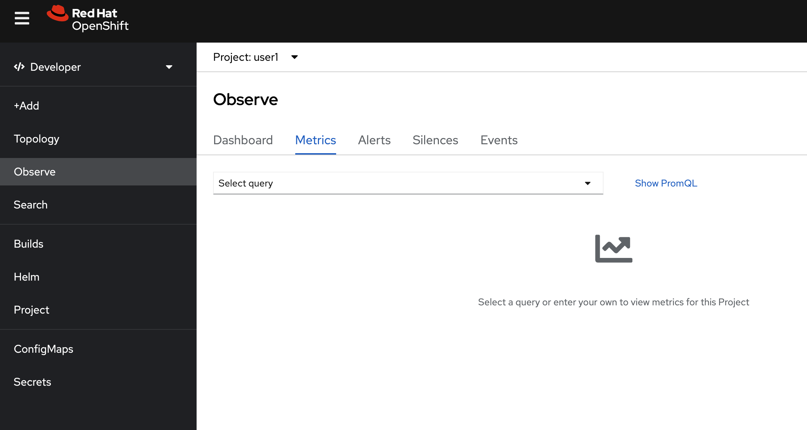         

- in select query, change to custom query, type `app` and wait auto suggesstion

  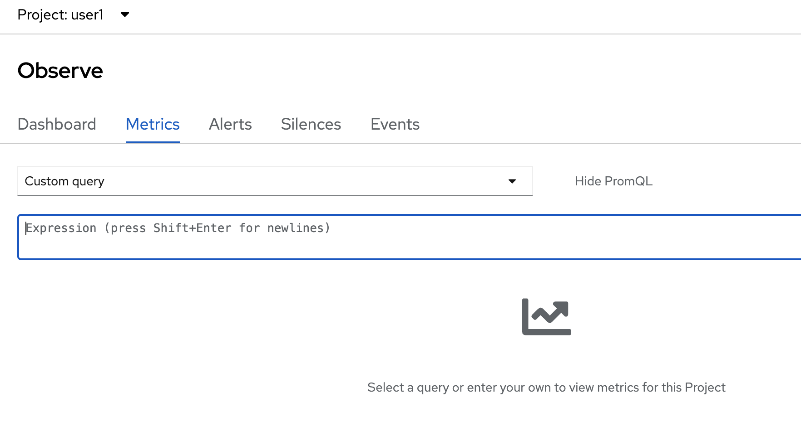

  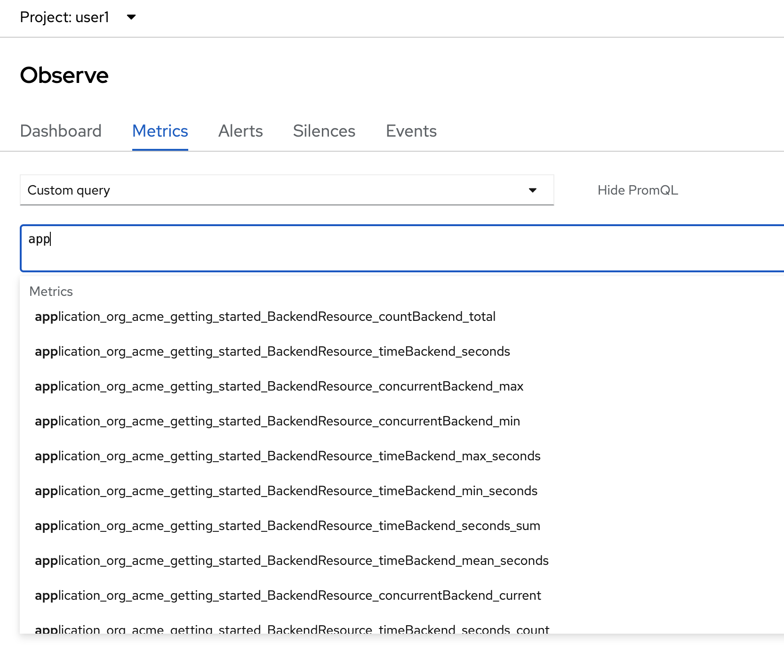

- Remark: if you don't found metrics 'application*' in auto suggession, wait a few minute and retry again
- select from suggestion or type in query box with `application_org_acme_getting_started_BackendResource_countBackend_total`, type enter.

   

- change your custom PromQL such as average tocal call backend service in 1 minute is   
  - type: `rate(application_org_acme_getting_started_BackendResource_countBackend_total[1m])`
  - enter
   
- Optional: test call backend 2-3 times and check metrics change in Monitoring Pages


## Add Alert to OpenShift
- Check `PrometheusRule` 
 
  ```yaml
  apiVersion: monitoring.coreos.com/v1
  kind: PrometheusRule
  metadata:
    name: backend-app-alert
    namespace: <username>
    labels:
      openshift.io/prometheus-rule-evaluation-scope: leaf-prometheus
  spec:
    groups:
    - name: backend
      rules:
      - alert: HighLatency
        expr: application_org_acme_getting_started_BackendResource_timeBackend_max_seconds>0.5
        labels:
          severity: 'critical'
        annotations:
          message: '{{ $labels.instance }} response time is {{ $value }} sec'
  ```

  HightLatency Alert will fire when response time is greateer than 1 sec  


- Create backend-app-alert
  click add icon (+) to open yaml editor
   
  
- input PrometheusRule yaml in editor and create (change `namespace!!!` before run)
  
  
  
- Test `HightLatency` , run k6 as pod on OpenShift
  
  ```bash
  BACKEND_URL=https://$(oc get route backend -n user1 -o jsonpath='{.spec.host}')/backend
  curl -o load-test-k6.js https://raw.githubusercontent.com/rhthsa/openshift-demo/main/manifests/load-test-k6.js
  oc run load-test -n user1 -i \
  --image=loadimpact/k6 --rm=true --restart=Never \
  --  run -  < load-test-k6.js \
  -e URL=$BACKEND_URL -e THREADS=25 -e DURATION=2m -e RAMPUP=30s -e RAMPDOWN=30s
  ```
  
  - 25 threads
  - Duration 2 minutes
  - Ramp up 30 sec
  - Ramp down 30 sec
  
  

  Check for alert in Developer Console by select Menu `Observe` then select `Alerts`

  


## Next Step
- [Viewing and working with logs generated by your application](logging.md)


