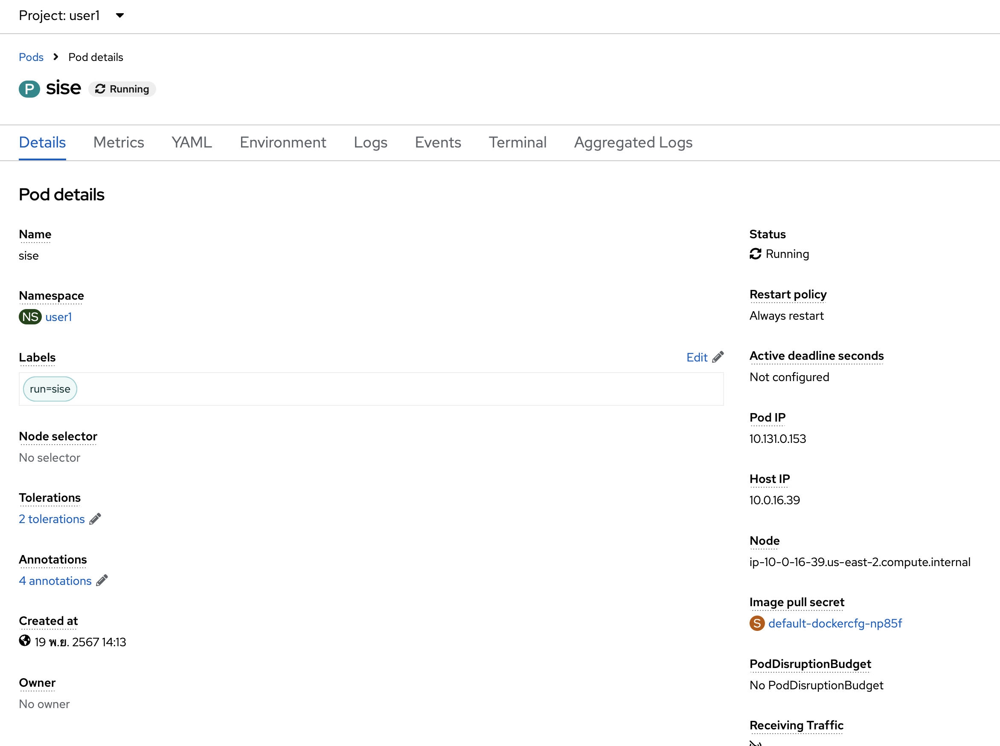
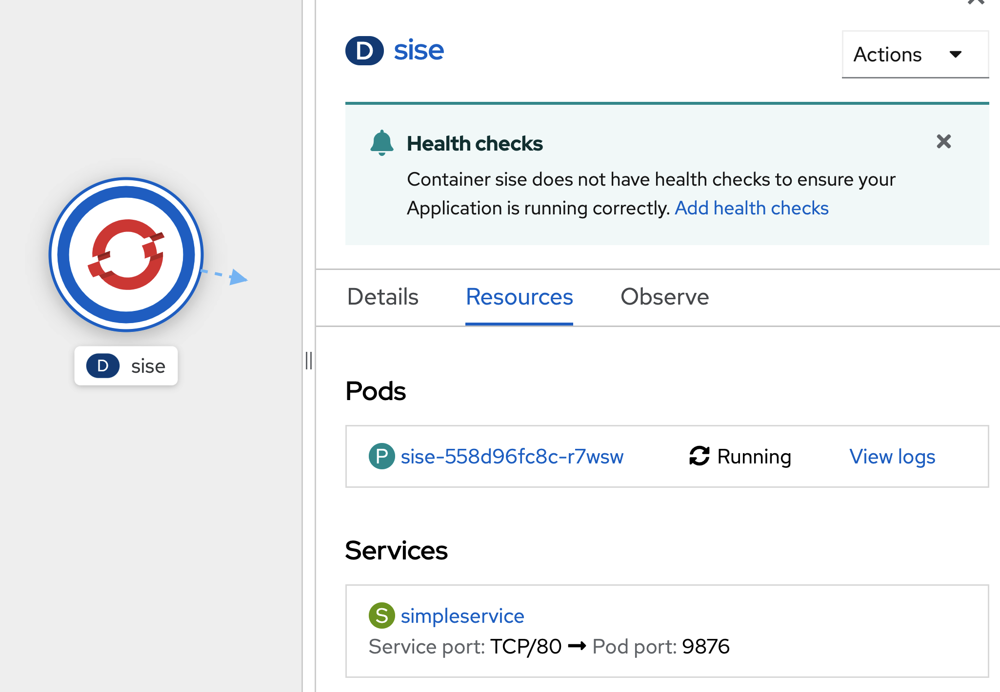

# Basic Openshift Topology
<!-- TOC -->

- [Basic Openshift Topology](#basic-openshift-topology)
  - [Prerequisite](#prerequisite)
  - [Pods](#pods)
  - [Labels](#labels)
  - [Deployment](#deployment)
  - [Service](#service)
  - [Route](#route)
  - [Next Step](#next-step)

<!-- /TOC -->
## Prerequisite
- Complete [Deploy java application (quarkus) to openshift with s2i](deploywiths2i.md)
- Go to your project (same as your username)
- Open Web Terminal by click '>_' on top of OpenShift Web Console
- use web terminal to run command line

## Pods
A pod is a collection of containers sharing a network, acting as the basic unit of deployment in Openshift. All containers in a pod are scheduled on the same node.  
To launch a pod using the container imagequay.io/openshiftlabs/simpleservice:0.5.0 and exposing a HTTP API on port 9876, execute:

  - example to run command in web terminal

  

run below command to start pod

```bash
oc run sise --image=quay.io/openshiftlabs/simpleservice:0.5.0 --port=9876
```
wait until sise pod circle change to dark blue


Check to see if the pod is running:

```bash
oc get pods
```

Result in output similar to the following:
```bash
NAME                                         READY   STATUS      RESTARTS   AGE
sise                                         1/1     Running     0          2m
```
This container image happens to include a copy of curl, which provides an additional way to verify that the primary webservice process is responding (over the local net at least):

```bash
oc exec sise -t -- curl -s localhost:9876/info
```

This call should produce the output:
```bash
{"host": "localhost:9876", "version": "0.5.0", "from": "127.0.0.1"}
```

or use Openshift Web Console to terminal to this Pod
- In Topology Menu, click Pod 'sise'
   
- In Pod sise information (right side), click pods 'sise'
   
- In Pod detail page, click tab 'Terminal'
   
- Openshift will create terminal to your container in Pod, see below picture
   
- test call curl command in terminal
  ```bash
  curl -s localhost:9876/info
  ```
- click Topology menu in left pane to back to topology of your project
- clean up your 'sise' pod
  - back to web terminal in buttom frame
  - at command prompt call below command for clean up pod (click restart terminal if your terminal is terminated)
  
  ```bash
  oc delete pod sise
  ```
- wait until pod 'sise' remove from your topology

## Labels
Labels are the mechanism used to organize Kubernetes objects. A label is a key-value pair with certain restrictions concerning length and allowed values but without any pre-defined meaning. You're free to choose labels as you see fit, for example, to express environments such as "this pod is running in production" or ownership, like "department X owns that pod".

- Let's create a pod that initially has one label (env=development):
  - Open Your Web Terminal and Check Current Project (same username)
  - run yaml for create pod from https://raw.githubusercontent.com/openshift-evangelists/kbe/main/specs/labels/pod.yaml
  ```bash
  oc apply -f https://raw.githubusercontent.com/openshift-evangelists/kbe/main/specs/labels/pod.yaml
  ```
- The get subcommand can be used to display a pod's labels:
  ```bash
  oc get pods --show-labels
  ```
  The labels are rendered as an additional column in the output:
  ```bash
  NAME      READY   STATUS    RESTARTS   AGE   LABELS
  labelex   1/1     Running   0          6s    env=development
  ```
- edit label with Openshift Web Console
  - click Pod 'labelex' on Topology page
  - in Pod 'labelex' information click tab Details
  
     
  
  - click edit link (near pencil icon) at lables section to view Edit labels
  - add 'owner=userx', change userx to your username such as user1 and save
  
    
  
  - view change
   
    
- use label for select Openshift Object
  - To use a label for filtering, use the -l option:
  ```bash
  oc get pods -l owner=user1
  ```
- clean up pod 'labelex'
  ```bash
  oc delete pods labelex
  ```

## Deployment
A deployment is a supervisor for pods, giving you fine-grained control over how and when a new pod version is rolled out as well as rolled back to a previous state.  

- Let's create a deployment called `sise-deploy` that produces two replicas of a pod as well as a replica set: (from https://raw.githubusercontent.com/openshift-evangelists/kbe/main/specs/deployments/d09.yaml)
  ```bash
  oc apply -f https://raw.githubusercontent.com/openshift-evangelists/kbe/main/specs/deployments/d09.yaml
  ```
- wait to deployment done, check result from Topology Page
   
- check result from Web Terminal
  ```bash
  oc get pod,replicaset,deployment
  ```
  The result is separated by resource type and reflects all of the resources created by the deployment: 
  ```bash
  NAME                                             READY   STATUS      RESTARTS   AGE
  pod/sise-deploy-747848cd97-j2m9q                 1/1     Running     0          90s
  pod/sise-deploy-747848cd97-kr9kd                 1/1     Running     0          90s

  NAME                                                   DESIRED   CURRENT   READY   AGE
  replicaset.apps/sise-deploy-747848cd97                 2         2         2       90s

  NAME                                        READY   UP-TO-DATE   AVAILABLE   AGE
  deployment.apps/sise-deploy                 2/2     2            2           90s
  ```
-  At this point in time the sise containers running in the pods are configured to return the version 0.9. Let's verify this from within the cluster using curl:
  ```bash
  POD=$(oc get pods --no-headers -l app=sise | grep sise |head -n 1| awk '{print $1}')
  oc exec $POD -t -- curl -s 127.0.0.1:9876/info
  ```
  The output reflects the current version of the deployed application:
  ```bash
  {"host": "127.0.0.1:9876", "version": "0.9", "from": "127.0.0.1"}
  ```
- Let's now see what happens if we change that version to 1.0 in an updated deployment: https://raw.githubusercontent.com/openshift-evangelists/kbe/main/specs/deployments/d10.yaml
  ```bash
  oc apply -f https://raw.githubusercontent.com/openshift-evangelists/kbe/main/specs/deployments/d10.yaml
  ```
  wait until redeploy complete!, in Topology , you will can see deployment redeploy from 0.9 to 1.0
- run command to check have redeploy to new version
  ```bash
  oc get pods -l app=sise
  ```
  result of command
  ```bash
  NAME                                         READY   STATUS        RESTARTS   AGE
  sise-deploy-67fd84bd5c-cvwpk                 1/1     Running       0          35s
  sise-deploy-67fd84bd5c-wn9zh                 1/1     Running       0          38s
  ```
- To verify that if the new 1.0 version is really available
  ```bash
  POD=$(oc get pods --no-headers -l app=sise | grep sise |head -n 1| awk '{print $1}')
  oc exec $POD -t -- curl -s 127.0.0.1:9876/info
  ```
  The output reflects the current version of the deployed application:
  ```bash
  {"host": "127.0.0.1:9876", "version": "1.0", "from": "127.0.0.1"}
  ```
- A history of all deployments is available via the `rollout history` subcommand:
  ```bash
  oc rollout history deploy/sise-deploy
  ```
  result
  ```bash
  deployment.apps/sise-deploy 
  REVISION  CHANGE-CAUSE
  1         <none>
  2         <none>
  ```
- to rollback to the last successful deployed revision of your configuration
  ```bash
  oc rollout undo deploy/sise-deploy
  ```
  wait until reploy complete (sise-deploy circle change to dark blue color), and retest call with curl command
- Clean Up
  ```bash
  oc delete deploy sise-deploy
  ```

## Service 
Services
A service is an abstraction for pods, providing a stable, so called virtual IP (VIP) address. While pods may come and go and with it their IP addresses, a service allows clients to reliably connect to the containers running in the pod using the VIP. The "virtual" in VIP means it is not an actual IP address connected to a network interface, but its purpose is purely to forward traffic to one or more pods. Keeping the mapping between the VIP and the pods up-to-date is the job of kube-proxy, a process that runs on every node, which queries the API server to learn about new services in the cluster.  
Let's create a new pod supervised by a replication controller and a service along with it:
- run below command in web terminal : 1st commond for deployment object and 2nd command for service
  - https://raw.githubusercontent.com/chatapazar/openshift-workshop/main/manifest/deployment.yaml
  - https://raw.githubusercontent.com/chatapazar/openshift-workshop/main/manifest/svc.yaml
  ```bash
  oc apply -f https://raw.githubusercontent.com/chatapazar/openshift-workshop/main/manifest/deployment.yaml
  oc apply -f https://raw.githubusercontent.com/chatapazar/openshift-workshop/main/manifest/svc.yaml
  ```
- see deployment, pod and service in topology view
  
- Verify the pod is running:
  ```bash
  oc get pods -l app=sise
  ```
- get Pod Name
  ```bash
  POD=$(oc get pods --no-headers -l app=sise | grep sise |head -n 1| awk '{print $1}')
  echo $POD
  ```  
- A new pod name should be generated each time this example is run. Make sure to include your own pod name when running the following examples:
  ```bash
  oc describe pod $POD
  ```
- The output should appear similar to the following (which has been truncated for readability):
  ```bash
  ...
    Status:       Running
    IP:           10.131.0.51
    IPs:
      IP:           10.131.0.51
    Controlled By:  ReplicaSet/sise-558d96fc8c
  ...
  ```
- You can, from within the cluster, access the pod directly via its assigned IP (change pod name and ip address from describe pod):
  ```bash
  oc exec $POD -t -- curl -s <ip address>:9876/info
  ```
- This is however, as mentioned above, not advisable since the IPs assigned to pods may change as pods are migrated or rescheduled. The service created at the start of this lesson, simpleservice, is used to abstract the access to the pod away from a specific IP:
  ```bash
  oc get service/simpleservice
  ```
- From within the cluster, we can now access any affiliated pods using the IP address of the simpleservice svc endpoint on port 80. KubeDNS even provides basic name resolution for Kubernetes services (within the same Kubernetes namespace). This allows us to connect to pods using the associated service name - no need to including IP addresses or port numbers.
  ```bash
  oc exec $POD -t -- curl -s simpleservice/info
  ```
- Let’s now add a second pod by scaling up the RC supervising it:
  ```bash
  oc scale --replicas=2 deployment/sise
  ```
- Wait for both pods to report they are in the "Running" state:
  ```bash
  oc get pods -l app=sise
  ```
  sample output
  ```bash
  NAME                    READY   STATUS    RESTARTS   AGE
  sise-558d96fc8c-7nblw   1/1     Running   0          18s
  sise-558d96fc8c-r7wsw   1/1     Running   0          13m
  ```
  see pod in deployment info page
  
- test call service, you can see out put from 2 pods
  ```bash
  oc exec $POD -t -- curl -s simpleservice/info
  ```
  sample output 
  ```bash
  oc exec $POD -t -- curl -s simpleservice/info
  {"host": "simpleservice", "version": "0.9", "from": "10.131.0.38"}
  oc exec $POD -t -- curl -s simpleservice/info
  {"host": "simpleservice", "version": "0.9", "from": "10.131.0.1"}
  oc exec $POD -t -- curl -s simpleservice/info
  {"host": "simpleservice", "version": "0.9", "from": "10.131.0.38"}
  oc exec $POD -t -- curl -s simpleservice/info
  {"host": "simpleservice", "version": "0.9", "from": "10.131.0.1"}
  ```  

## Route
route exposes a service at a host name, like www.example.com, so that external clients can reach it by name.
- create route for service
  ```bash
  oc expose service/simpleservice 
  ```
- get route from command line
  ```bash
  oc get route simpleservice
  ```
  example output
  ```bash
  NAME            HOST/PORT                                                           PATH   SERVICES        PORT   TERMINATION   WILDCARD
  simpleservice   simpleservice-user1.apps.cluster-4b8f.4b8f.sandbox930.opentlc.com          simpleservice   9876                 None
  ```
- or get route from web console, go to topology, click sise deployment, view Route
   
- test call route from command line (in your laptop or web terminal)
  ```bash
  curl http://$(oc get route simpleservice -o jsonpath='{.spec.host}')/info
  ```
  example 
  ```bash
  bash-4.4 ~ $ oc get route simpleservice
  NAME            HOST/PORT                                                           PATH   SERVICES        PORT   TERMINATION   WILDCARD
  simpleservice   simpleservice-user1.apps.cluster-4b8f.4b8f.sandbox930.opentlc.com          simpleservice   9876                 None
  bash-4.4 ~ $ curl http://simpleservice-user1.apps.cluster-4b8f.4b8f.sandbox930.opentlc.com/info
  {"host": "simpleservice-user1.apps.cluster-4b8f.4b8f.sandbox930.opentlc.com", "version": "0.9", "from": "10.128.2.26"}
  bash-4.4 ~ $ 
  ```
- clean up application
  ```bash
  oc delete route simpleservice
  oc delete -f https://raw.githubusercontent.com/chatapazar/openshift-workshop/main/manifest/svc.yaml
  oc delete -f https://raw.githubusercontent.com/chatapazar/openshift-workshop/main/manifest/deployment.yaml

  ```

## Next Step
- [Configuration Management with Environment Variable, Configmap & Secret](evconfigsecret.md)