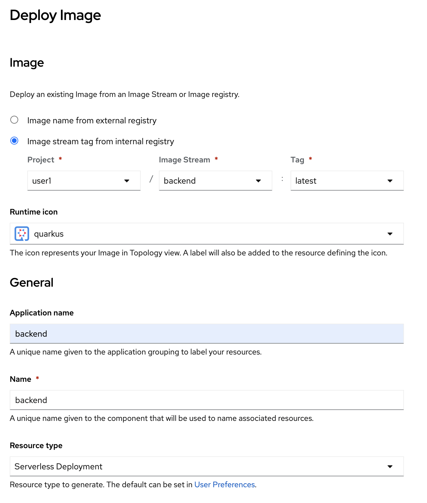
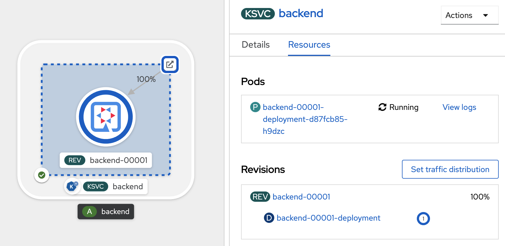

# Basic Serverless, auto scale up & scale down by request
<!-- TOC -->

- [Basic Serverless, auto scale up \& scale down by request](#basic-serverless-auto-scale-up--scale-down-by-request)
  - [Prerequisite](#prerequisite)
  - [Change your application to Serverless](#change-your-application-to-serverless)
  - [Congratulation, You Complete This LAB!!!](#congratulation-you-complete-this-lab)

<!-- /TOC -->
## Prerequisite
- Complete [Deploy application to openshift with s2i](deploywiths2i.md)
- Go to your project (same as your username)
- Open Web Terminal by click '>_' on top of OpenShift Web Console
- use web terminal to run command line

## Change your application to Serverless
- From Topology view, open web terminal, delete route, service and deployment of backend

  

  with below command (change project name to your project name such as 'userx')

  ```bash
  oc project user1
  oc delete route/backend
  oc delete service/backend
  oc delete deployment/backend
  ```

- redeploy application again with openshift serverless (serving) feature, click Add+ in left menu, select deploy from container images

  

- in image section, select Image stream tag from internal registry, select project `userx` (your username), image stream `backend` and Tag `latest`
- in general section, set Application name: `backend`, Name: `backend`
- in resources seciton, select `Serverless Deployment`

  

- for advanced options, leave all default, click create

  

- wait until deploy complete, click KSVC `backend`

  

- test backend application click route icon to open application in new tab

  

- wait until application auto scale down (1 minute)

  

- in topology view, no pod start and deployment show 0 pod

  

- test call application again by click route, serverless will automatic start pod.

  

## Congratulation, You Complete This LAB!!!


