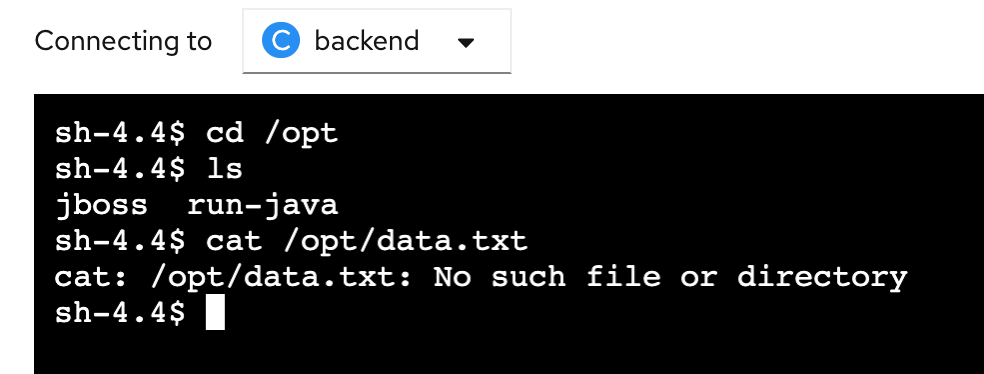
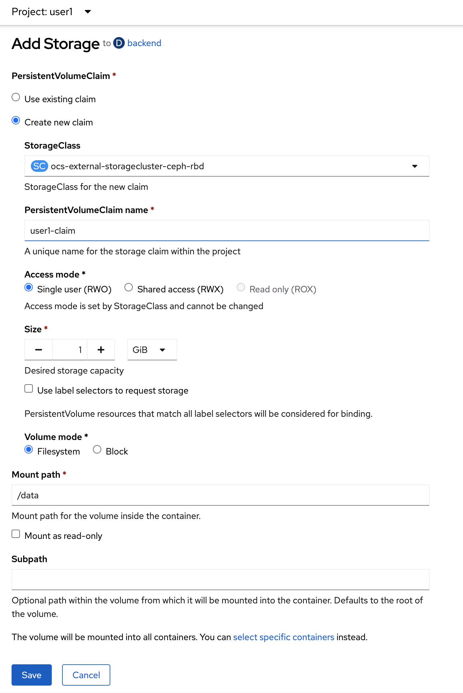

# Container Storage
<!-- TOC -->

- [Container Storage](#container-storage)
  - [Prerequisite](#prerequisite)
  - [Test Create File in Container](#test-create-file-in-container)
  - [Create Persistence Data for Container](#create-persistence-data-for-container)
  - [Next Step](#next-step)

<!-- /TOC -->
## Prerequisite
- Complete [Deploy application to openshift with s2i](deploywiths2i.md)
- Go to your project (same as your username)
- Open Web Terminal by click '>_' on top of OpenShift Web Console
- use web terminal to run command line

## Test Create File in Container
- From Topology view, click Duke icon (backend deployment), in backend deployment view, select Resources Tab

  

- Click link of pod name in Pods section

  

- in Pod Details, select Terminal Tab to enable Terminal to container

  

- In terminal console, test create file in container

  ```bash
  cd /opt
  echo 'This is a test' > data.txt
  cat /opt/data.txt
  ```

  example 

  

- scale down backend application to 0, back to topology, click Duke icon, in details tab of backend Deployment, click scale down to 0

  

  

- after scale to 0 complete, scale up backend application to 1 again

  

  

- Recheck data in container, click at resource tab in backend deployment, select pod 'backend-xxx-xxx' link in Pods section

    

- in pod details, select terminal tabs to activate terminal console to pod
- re test with below command, data.txt not found in current container becouse we don't have persistent storage for it.

  ```bash
  cd /opt
  ls
  cat /opt/data.txt
  ```

  example output

  
  
## Create Persistence Data for Container
- back to topology, click Duke icon to open backend deployment panel, select action menu dropdownlist, select add storage

  

- in add storage, select
  - Persistent Volume Claim: `create new claim`
  - storage class: leave default storage class
  - Persistent Volume Claim Name: `userx-claim` (change userx to your user name)
  - access mode: Single User(RWO)
  - size: `1` GiB
  - Volume Mode: `Filesystem`
  - Mount Path: `/data`

  example result

  

- click save and wait until backend redeploy complete

  

  

- in backend deployment, go to pods tabs, select pod name link 'backend-xxx-xxx'

  

- go to terminal tab again to open terminal to container, create file again for test persistent

  ```bash
  cd /data
  echo 'This is a test' > data.txt
  cat /data/data.txt
  ```

  example output

    

- bact to topology, click duke icon, in Details Tab, scale down backend deployment to 0 and scale up to 1 again (wait until scale complete before go to next step)

  

- go to pod terminal again, go to Resources Tab, click pod link 'backend-xxx-xxx' in pod section  

    

- go to terminal tab to open terminal and retest with below command

  ```bash
  cd /data
  ls
  cat data.txt
  ```

  example output, you will found data.txt 

    
  
## Next Step

- [Basic Serverless, auto scale up & scale down by request](serverless.md)


